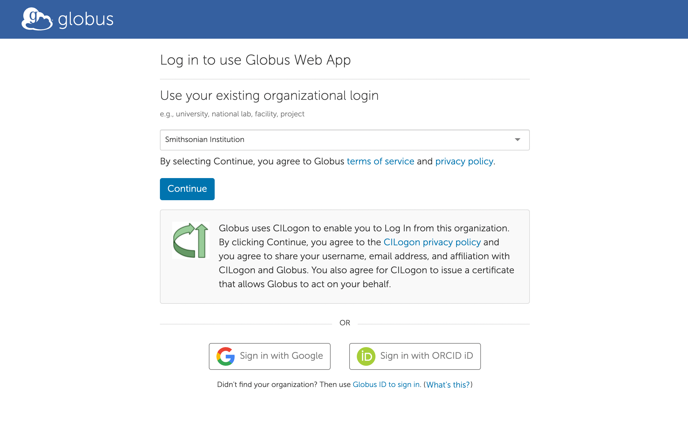
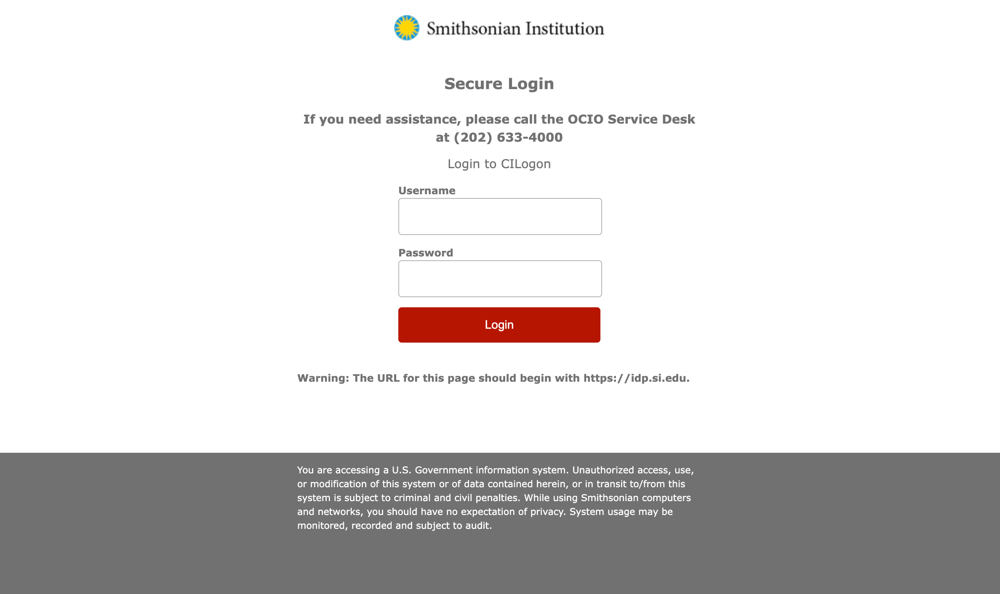
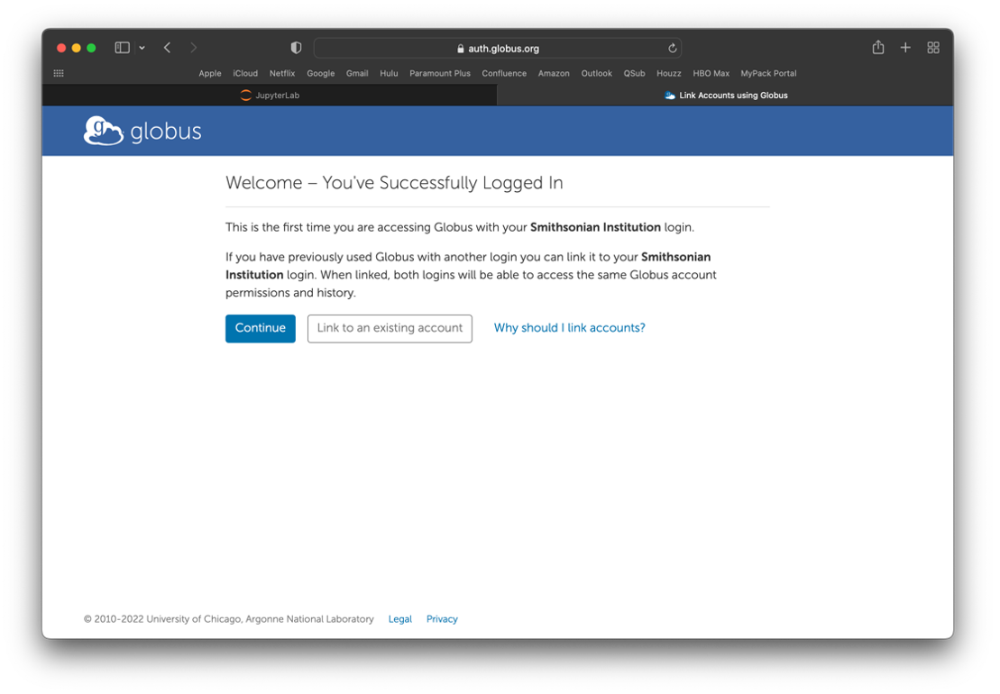
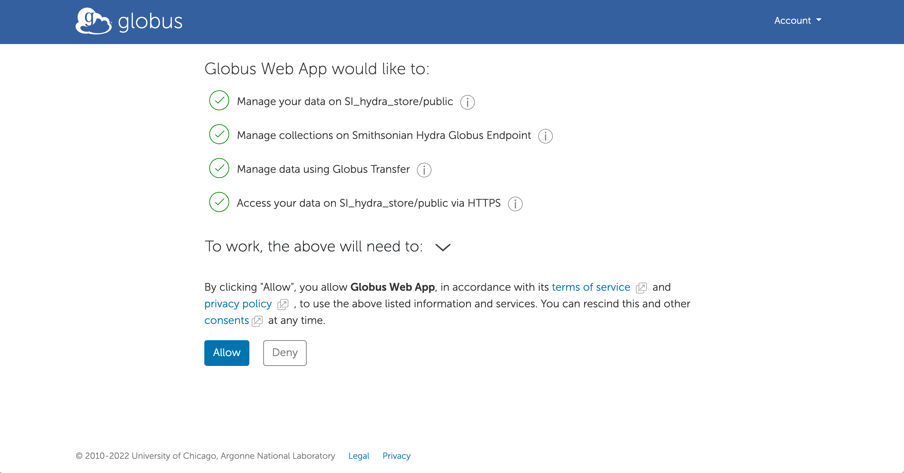
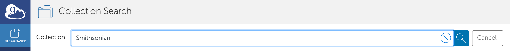
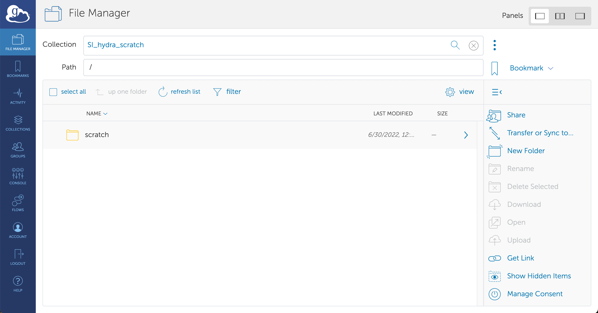
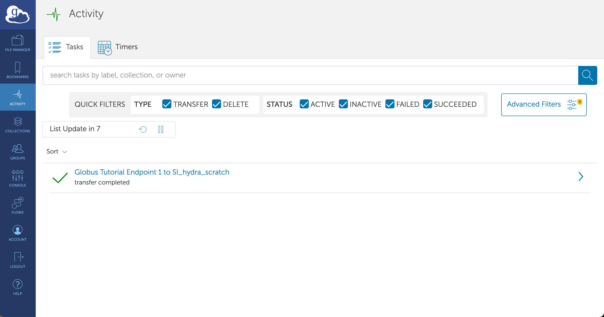

# Globus

[Globus](https://www.globus.org/) moves data between storage systems registered with it, on Hydra's behalf and without a session open: you set the transfer up in a browser, and Globus retries, verifies and reports it. It is the tool for transfers of hundreds of gigabytes, for data at another institution, and for a transfer that has to survive a closed laptop. Two endpoint nodes, `hydra-globus01` and `hydra-globus02`, serve Hydra's collections. More in-depth instructions for using Globus beyond Hydra are available at <https://smithsonian.github.io/globus-docs/>.

## Sign in

1. Open [app.globus.org](https://app.globus.org) and choose **Smithsonian Institution** as the organisation:

    

2. Sign in on the SI page with your SI network username (the part of your email address before `@si.edu`) and password, not your Hydra password:

    

3. The first time, Globus asks whether to link an existing Globus account; choose **Continue** if you have none, and complete the sign-up.

    

4. Allow the Globus web app to manage data on your behalf when it asks:

    

## Open your Hydra directory

1. In the File Manager, search the **Collection** box for `Smithsonian`:

    

    The Hydra collections begin with `SI_hydra_`:

    

    | Collection | Path |
    |---|---|
    | `SI_hydra_scratch` | `/scratch` |
    | `SI_hydra_scratch_SAO` | `/scratch`, the SAO project partitions |
    | `SI_hydra_store/public` | `/store/public` |

2. The first time you open a collection, allow Globus to access it when asked:

    

3. Navigate to your directory, for example `/scratch/genomics/USERNAME`:

    

Globus sees files with the same permissions as your Hydra account: what you cannot read on a login node, you cannot read here.

## Transfer

1. With your Hydra directory open in one pane, switch the File Manager to two panes (the middle of the three layout buttons, top right) and open the other collection in the second pane: another institution's, a Globus Connect Personal endpoint on your computer, or the `Globus Tutorial Endpoint` collections for a test.

    

2. Select files or directories in the source pane and click **Start**; the arrow on the button shows the direction.

    

    Globus confirms the request at the top of the page:

    

3. Follow the transfer under **Activity** in the left bar. Globus emails you when it finishes or fails.

    

## Transfer to and from your own computer

Your computer becomes a collection when it runs Globus Connect Personal. On a machine you administer, install it from Globus's instructions for [macOS](https://docs.globus.org/how-to/globus-connect-personal-mac), [Windows](https://docs.globus.org/how-to/globus-connect-personal-windows) or [Linux](https://docs.globus.org/how-to/globus-connect-personal-linux); on a Smithsonian-administered machine, install it from Software Center.
