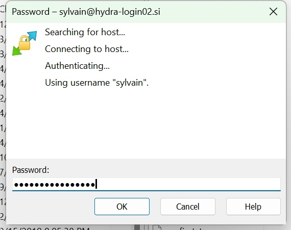
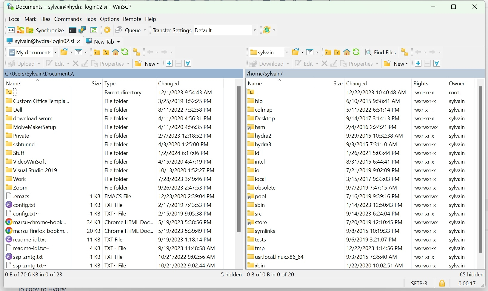
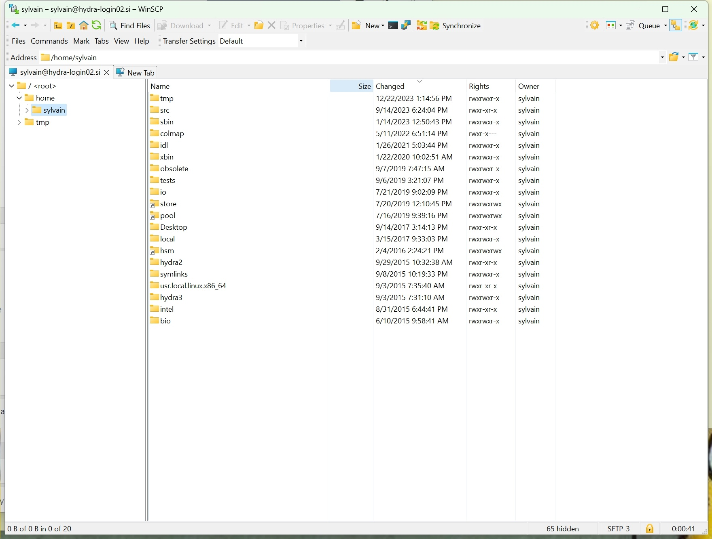
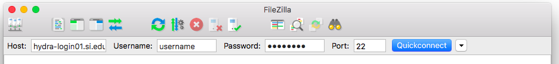
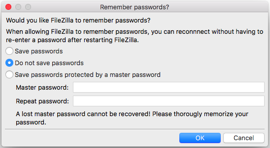
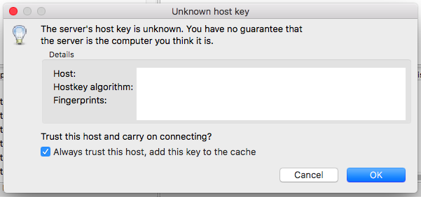
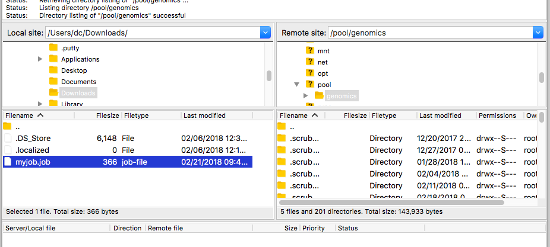

# scp, sftp and rsync

The login nodes accept `scp`, `sftp` and `rsync` from any computer on the Smithsonian network or the SI VPN, and any graphical client that speaks the sftp protocol works the same way. From Hydra outward, the same tools reach any host that accepts an ssh connection from the login nodes. Give a transfer a destination under `/scratch` or `/data`, never `/home` or `/tmp`.

For anything over about 70 GB, use `rsync` and cap the rate with `--bwlimit=20000` (20 MB/s, 70 GB per hour), so that one transfer does not fill the link for everyone. Email [SI-HPC@si.edu](mailto:SI-HPC@si.edu) if a transfer needs more than that.

## Copy files with scp

`scp` comes with macOS, Linux and Windows 10 and later. Open a terminal (Terminal on macOS; Command Prompt or PowerShell on Windows), `cd` to the directory the files are in, and copy to Hydra:

```console
$ scp -p results.tar USERNAME@hydra-login01.si.edu:/scratch/genomics/USERNAME/project/
$ scp -p reads_*.fastq.gz USERNAME@hydra-login01.si.edu:/scratch/genomics/USERNAME/project/
```

The destination directory must exist. `-p` keeps the files' modification times. Copy from Hydra by reversing the arguments; quote a wildcard so that Hydra expands it, not your shell:

```console
$ scp -p USERNAME@hydra-login01.si.edu:/scratch/genomics/USERNAME/project/results.tar .
$ scp -p 'USERNAME@hydra-login01.si.edu:/scratch/genomics/USERNAME/project/*.log' .
```

## Copy or synchronise with rsync

`rsync` comes with macOS and Linux (on Windows, through WSL or Cygwin). It copies only files that are new or changed, so a second run after an interruption finishes the job rather than starting over, and it takes a rate limit.

```console
$ rsync -avz --bwlimit=20000 project/ USERNAME@hydra-login01.si.edu:/scratch/genomics/USERNAME/project/
$ rsync -avz USERNAME@hydra-login01.si.edu:/scratch/genomics/USERNAME/project/results/ results/
```

`-a` copies directories recursively with permissions and times, `-v` lists each file, `-z` compresses in transit. A trailing slash on the source copies its contents; without it, the directory itself. `-n` lists what the run would copy and copies nothing. `man rsync` lists the rest.

## Use sftp

`sftp` opens a session and takes commands; it is on the same systems as `scp`:

```console
$ sftp USERNAME@hydra-login01.si.edu
sftp> cd /scratch/genomics/USERNAME/project
sftp> put results.tar
sftp> get summary.csv
sftp> exit
```

`cd` and `lcd` change the remote and local directories; `put` uploads, `get` downloads.

## Use WinSCP on Windows

[WinSCP](https://winscp.net/) copies files by drag and drop over sftp.

1. In the Login window, set the file protocol to SFTP, the host name to `hydra-login01.si.edu`, the port to 22, and your Hydra username; leave the password blank and click **Login**:

    

2. Accept the host key the first time, then enter your Hydra password when the login dialog asks for it:

    

3. Your computer is in the left pane and your Hydra home directory in the right. Navigate the right pane to a directory under `/scratch` or `/data` before copying anything:

    

4. Drag files between the panes to copy them. The Transfer Settings bar shows progress:

    

## Use FileZilla on any system

[FileZilla](https://filezilla-project.org/) works the same way on macOS, Windows and Linux.

1. In the Quickconnect bar, enter the host `hydra-login01.si.edu`, your Hydra username, your password and port 22, and click **Quickconnect**:

    

2. The first time, FileZilla asks whether to save passwords; choose **Do not save passwords**:

    

3. Accept the host key when FileZilla shows it:

    

4. Your computer is on the left and Hydra on the right. Navigate the right side to a directory under `/scratch` or `/data`, then drag files between the two sides:

    

Cyberduck is not recommended: it keeps a process busy on the login node, which the login-node limits then kill.

## Keep the load down

`rm`, `mv` and `cp` on thousands of files load the file servers as much as a transfer does. Run large file operations one after another rather than several at once, and run anything that takes more than a few minutes under `qrsh` or as a job rather than on a login node.
