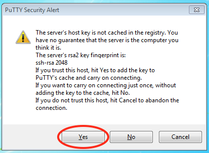

# Logging in and passwords

You reach Hydra through an **ssh** connection to one of its two login nodes, `hydra-login01.si.edu` and `hydra-login02.si.edu`. Either one will do. They share your home directory and see the same cluster. From a computer on the Smithsonian network or the SI VPN you connect with an ssh client. From anywhere else you use the web terminal on telework.si.edu.

## Where you can connect from

The login nodes accept connections only from:

- a computer on the Smithsonian network,
- a computer connected to the SI VPN ([VPN authentication instructions](https://smithsonianprod.servicenowservices.com/si?sys_kb_id=e2996a031b79ae50e5c0657ae54bcb5d&id=kb_article_view&sysparm_rank=1&sysparm_tsqueryId=b8c7ecb2cf9f43500b16fb152f851cc6)), or
- the web terminal on [telework.si.edu](https://telework.si.edu/), which works from anywhere.

A connection from anywhere else is refused before you are asked for a password.

## Log in

!!! warning "Three failed logins lock the account for 15 minutes"

    Wait the 15 minutes before trying again. Retrying during the lockout restarts it.

Replace `USERNAME` with your Hydra username from your welcome email, in lower case.

=== "macOS and Linux"

    Open a terminal (on macOS, Terminal is in `/Applications/Utilities`) and run:

    ```bash
    ssh USERNAME@hydra-login01.si.edu
    ```

    The first time you connect, ssh asks you to confirm the host key. Type `yes`. It is asking whether you trust the computer at the other end, and after the first time it remembers the answer.

    ```text
    The authenticity of host 'hydra-login01.si.edu' can't be established.
    RSA key fingerprint is ...
    Are you sure you want to continue connecting (yes/no)? yes
    ```

    At the `Password:` prompt, type your password. Nothing is echoed while you type, not even dots.

=== "Windows"

    Windows 10 (version 1803 and later) and Windows 11 include ssh. Open Command Prompt or PowerShell from the Start menu and run:

    ```bash
    ssh USERNAME@hydra-login01.si.edu
    ```

    The first time you connect, ssh asks you to confirm the host key. Type `yes`. It is asking whether you trust the computer at the other end, and after the first time it remembers the answer.

    ```text
    The authenticity of host 'hydra-login01.si.edu' can't be established.
    RSA key fingerprint is ...
    Are you sure you want to continue connecting (yes/no)? yes
    ```

    At the `Password:` prompt, type your password. Nothing is echoed while you type, not even dots.

    If instead you see `'ssh' is not recognized as an internal or external command`, use [PuTTY](https://www.chiark.greenend.org.uk/~sgtatham/putty/latest.html). Download `putty.exe` (no installer needed) and start it. Enter `USERNAME@hydra-login01.si.edu` as the Host Name and click **Open**:

    

    The first time, PuTTY shows a security alert about the server's host key. Click **Yes** to accept it. PuTTY then remembers it.

    

=== "Web browser (telework)"

    1. Sign in at [telework.si.edu](https://telework.si.edu/).
    2. Expand **IT Tools** and choose **Hydra** (type `hydra` in the search box to find it).
    3. Choose one of the **Web SSH terminal (WeTTY)** links.
    4. Enter your Hydra username at the `login:` prompt and your password at the `password:` prompt.

    

You are logged in when the prompt changes to:

```text
[USERNAME@hydra-login01 ~]$
```

## Log in without a password

On macOS and Linux you can use an **ssh key pair** instead of a password. The pair is a private key that stays on your computer and a public key that you copy to Hydra. Generate a pair with `ssh-keygen` (accept the defaults, and give the key a passphrase), then copy the public key to Hydra:

```bash
ssh-copy-id USERNAME@hydra-login01.si.edu
```

The home directory is shared by both login nodes, so one copy serves `hydra-login02.si.edu` too. From then on `ssh`, `scp` and `rsync` to either node ask for the key's passphrase, or for nothing if your computer's keychain holds it, rather than for your Hydra password.

## Passwords

You set your initial password from the link in your welcome email. A password is valid for 180 days, and Hydra emails you before it expires. Change it before then, either with `passwd` on a login node or on the self-service page. The self-service page also resets a password you have forgotten, and one that has expired, for 14 days after the expiry date. After those 14 days the account locks and only we can reset it.

!!! note "Password requirements"

    A password has at least 12 characters, with at least one digit, one upper-case letter, one lower-case letter and one special character. A new password must not be similar to a previous one.

### Change your password from the command line

While your password is still valid, log in and run `passwd`:

```console
$ passwd
Changing password for user USERNAME.
(current) LDAP password:
New password:
Retype new password:
```

The change applies to both login nodes immediately.

### Change or reset your password on the self-service page

Use the self-service page to change a password you know, to reset one you have forgotten, or to reset one that expired less than 14 days ago.

1. Open the page. From the SI network or VPN, go directly to <https://hydra.si.edu/ssp/>. From telework.si.edu, choose **Hydra** under IT Tools, then **Change Password on Hydra-7** or **Reset Password on Hydra-7**.
2. To reset, enter your Hydra username and click **Send**. The page emails a link to your canonical address, usually the one ending in `.edu`.
3. Follow the link. From telework, paste it into the **Enter internal resource** box on the telework home page instead of opening it directly, because the link points at a server that only the SI network can reach.

    

4. Enter your new password.

### Unlock an account after 14 days

Once a password has been expired for more than 14 days the account is locked and the self-service page no longer works for it. Email [SI-HPC-Admin@si.edu](mailto:SI-HPC-Admin@si.edu) to request a reset. The instructions come to your work email address.

## Further reading

- [Quick start](quick-start.md) for your first job once you are logged in
- [Start an interactive session](../interactive/qrsh.md) for a shell on a compute node rather than a login node
- [scp, sftp and rsync](../data-transfer/scp-rsync.md) which use the same ssh connection to move files
