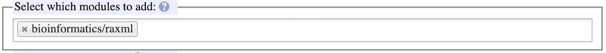
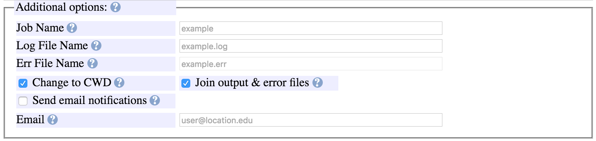
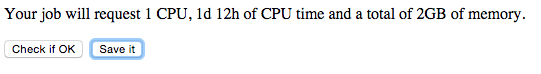

# QSub Generator

!!! note
    The material on this page is part of the Quick Start Guide and is not exhaustive. For more details, please see the Reference Pages.

## Introduction

When submitting jobs to the cluster, you need to tell the job scheduler details about your run (run time, memory needed, CPUs needed etc.) AND the actual commands that you will be running for your analysis.

You can use the QSub Generator for both. ## How to Use QSubGen

To use the QSub Generator:

1. Open the [QSub Generation Utility](https://hydra-7.si.edu/tools/QSubGen/) web page. 
This utility works best on Chrome or Firefox. Safari is not recommended. 
The question mark icons by each entry in the form provide useful information on each item including formatting: 
The example below shows how to setup a RAxML job that will use a single CPU to run bootstraps and a best tree analysis.
2. *Time and memory* 
 
*CPU Time:* Enter the maximum time allowed for your job in "CPU time" by entered an exact time in the text box or using the drop-down menu. 
After this time is reached, your job will be terminated. 
The drop-down menu will update the time in the text box to show the length of the pre-defined times. 
CPU time is the amount of time that the processor is using, not the "wall clock" time which is the elapsed time since the job started. 
For jobs using more than one CPU, the amount of CPU time granted to the job (before it gets terminated) is the product of number of CPUs and the time allocated, while the allowed wall clock time is not multiplied by the number of CPUs. 
 
*Memory:* is the maximum memory that your run will use. 
Some programs will have memory use estimators. In this RAxML example you can use a memory estimator [here](http://sco.h-its.org/exelixis/web/software/raxml). 
The value in the memory box is per-CPU. 
 
*VMem*: the amount of virtual memory can be specified to be different from the (resident) memory. 
The vmem is set to the value of memory when you specify that amount.
3. *Parallel Environment* 
 
In this section you define how many CPUs your job will use. The software documentation will indicate if it is limited to one CPU (serial), multiple CPUs spread across servers in the cluster (MPI), or multiple CPUs residing on one server (multi-thread). 
In this example we are only using one CPU (serial). 
Refer to the software documentation for information about parallel use supported. Software documentation through the module system (described below) may also give more information.
4. *GPUs 
*In this section you select whether your job will use GPUs, the type of GPU(s) and how many. 
You code must be capable of leveraging the GPU(s). 
 **
5. *Shell* 
 
For novice bioinformatics users, we recommend that select sh. 
A shell is the program on the computer that interprets your commands. Consult [Wikipedia article](https://en.wikipedia.org/wiki/Shell_(computing)) for more info.
6. *Modules* 
 
Hydra uses the [modules](http://modules.sourceforge.net) system to load programs that use the command line. There is a module for each program on the server which includes: where the program is located, other programs it depends on, some help information about starting the program on the cluster. The module may refer to a specific version, or in this case "bioinformatics/raxml" will always refer to the newest version of RAxML installed on the cluster. A [web-based list of available modules is available](https://www.cfa.harvard.edu/~sylvain/hpc/module-avail.html). 
You can start typing a program name to see a list of modules that match.
7. *Commands* 
 
In this section you put your commands that will be run on the cluster. You start with the name of executable, `raxmlHPC-SSE3` in this case, and include all command line options and references to data files. 
You can find the name of executables by [logging into hydra](../../getting-started/login.md) via the terminal and typing `module help bio/raxml/latest` (replacing with the module file you will be using). 
For MPI jobs, start with `mpirun np $NSLOTS` followed by the executable name and command line options.
8. *Additional options* 
 
In this section you give some more information that will be used to run your job and log the output. 
*Job Name:* Name the job will be called in the cluster job list (no spaces allowed) 
*Log File Name:* File where [stdout](https://en.wikipedia.org/wiki/Standard_streams) will be sent. Will be filled in automatically with the Job Name. 
*Error File Name:* File where [stderr](https://en.wikipedia.org/wiki/Standard_streams) will be sent if output and error files are *not* split. Will be filled in automatically with the Job Name. 
*Change to CWD:* Always check. Will put log files in the directory from which you start your job (your current working directory). 
*Join stderr & stdout:* Recommend to check. Will put all program output into one file (named in "Log File Name"). 
*Send email notifications:* Emails will be send when your job starts and ends. 
*Email:* Where notifications are sent. This can be any email account.
9. *Check file and download* 
Press the "Check if OK" button to confirm that script (in the gray box) was generated correctly. 
 
Use the "Save it" button to save the .job file. 
 
Above the Save it button is the time and total RAM being requested for your job.
10. Upload to Hydra 
[Upload this .job file](../../data-transfer/scp-rsync.md) that is generated to Hydra in the /scratch or /data folder to be used for your job.

Last update 09 Dec 2025 SGK/MPK
