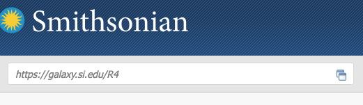

# RStudio server

Hydra has a dedicated RStudio server at <https://galaxy.si.edu/R4>. A browser opens an RStudio session on a node with 192 CPU cores and 1.5 TB of memory, with your Hydra home directory, `/data`, `/scratch` and `/store` mounted. It runs R 4.5.3 and RStudio Server 2024.12.0+467, the same for every user, and needs no tunnel and no `qrsh`.

## Log in

1. From the SI network or the SI VPN, open <https://galaxy.si.edu/R4> in the browser:

    

    From telework.si.edu, enter `https://galaxy.si.edu/R4` in the **Enter an internal resource** box on the telework home page and press Return:

    

2. Sign in with your Hydra username, in lower case, and your Hydra password:

    

3. RStudio opens in the browser with the same layout as the desktop version:

    

The **Files** pane shows Hydra's partitions. Navigate to a directory under `/scratch` or `/data` to work there:


## Sessions

The node is shared with every other user. One R session per user runs at a time. Logging in from a second browser takes over the existing session rather than starting another. A session keeps running when you close the browser or log off your computer, with its objects in memory and its computations under way. Logging in again reconnects to it. To run several analyses at once inside the one session, use the **Background Jobs** tab ([Posit's guide](https://docs.posit.co/ide/user/ide/guide/tools/jobs.html)).

!!! warning "Quit the session when you are done"

    An idle session holds memory that other users cannot get. **Session** and then **Quit Session…** ends it; closing the browser does not.


If the server refuses to log you back in after you used its log-off button, clear the browser's cookies for galaxy.si.edu.

## Move files in and out

The **Files** pane transfers files; for anything large or many files, use [Data transfer](../data-transfer/index.md) instead.

- Upload: **Upload** in the Files pane, one file at a time. To upload several, zip them on your computer; the server unzips the archive on arrival.

    

- Download: tick the files or folders, then **More** and **Export…**. Several files or a folder come down as one zip.

    

    

## Install packages

`install.packages()` and `BiocManager::install()` work as on a desktop, into your personal library at `~/R/x86_64-redhat-linux-gnu-library/4.5`, which other users do not see. Every package compiles from source on Linux, so installs take minutes; `Ncpus` parallelises them:

```r
install.packages("seqinr", Ncpus = 8)
BiocManager::install("phyloseq", Ncpus = 8)
```

### Packages that need a newer GCC

Some packages (ade4 and seqinr among them) need a newer compiler than the server's system GCC and fail with missing `GLIBCXX` symbols or OpenMP errors. The server cannot load compiler modules, so point R at one of Hydra's GCC installations with a `~/.R/Makevars` file.

1. If `~/.Renviron` sets compiler paths, remove it; mixed compiler settings are the usual cause of the errors:

    ```console
    $ rm ~/.Renviron
    ```

2. Create the Makevars file, in the RStudio **Terminal** (not the R console):

    ```console
    $ mkdir -p ~/.R
    $ nano ~/.R/Makevars
    ```

    ```make title="~/.R/Makevars"
    CC = /share/apps/tools/gcc/14.2.0/bin/gcc
    CXX = /share/apps/tools/gcc/14.2.0/bin/g++
    CXX11 = /share/apps/tools/gcc/14.2.0/bin/g++
    CXX14 = /share/apps/tools/gcc/14.2.0/bin/g++
    CXX17 = /share/apps/tools/gcc/14.2.0/bin/g++
    FC = /share/apps/tools/gcc/14.2.0/bin/gfortran
    F77 = /share/apps/tools/gcc/14.2.0/bin/gfortran

    CFLAGS = -O2 -g -fopenmp -fpic
    CXXFLAGS = -O2 -g -fopenmp -fpic
    CXX11FLAGS = -O2 -g -fopenmp -fpic
    CXX14FLAGS = -O2 -g -fopenmp -fpic
    CXX17FLAGS = -O2 -g -fopenmp -fpic
    FFLAGS = -O2 -g -fpic
    FCFLAGS = -O2 -g -fpic
    ```

    Every line names the same GCC. `14.2.0` can be any of 9.2.0, 9.3.0, 10.1.0 (OpenMP 4.5), 11.2.0, 12.2.0 (OpenMP 5.0), or 13.2.0, 14.2.0, 15.2.0 (OpenMP 5.1); ade4 needs 10.1.0 or newer.

3. **Session** and then **Restart R**; the compiler settings take effect in the new session.

4. Install as usual.

To go back to the system GCC, delete `~/.R/Makevars` and restart R. A package that installs but fails to load points at a Makevars file in which the lines name different GCC versions.

## Temporary files

R writes temporary files under `/tmp` on the node, which is small and shared. Put them under your own space by setting `TMPDIR` in `~/.Renviron`, or in `.Renviron` in the project directory. A shell `export` has no effect, because the server's R session does not read your shell's environment:

```text title="~/.Renviron"
TMPDIR=/scratch/genomics/USERNAME/tmp
```

## Further reading

- [R](../software/r.md) for the R modules, packages and how to run R in a batch job
- [RStudio on a compute node](rstudio-node.md) for a different R or more than one session
- [Storage](../storage/index.md) for where to keep data and projects
