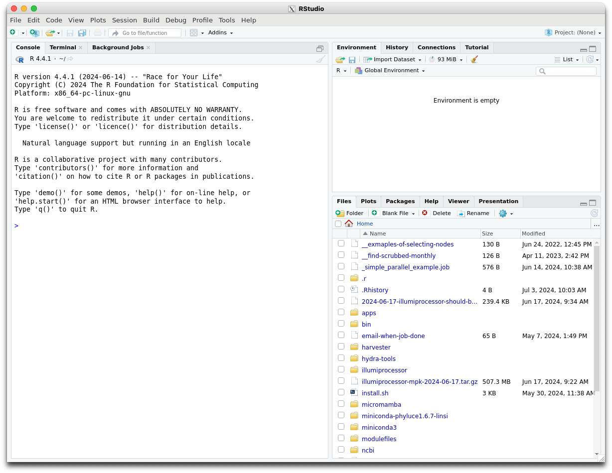
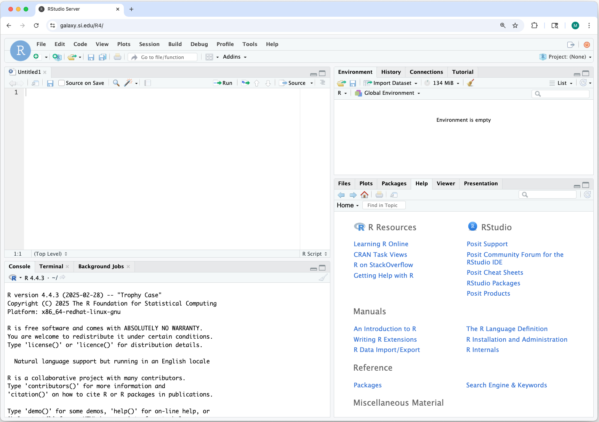
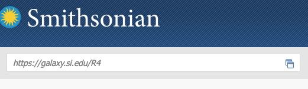
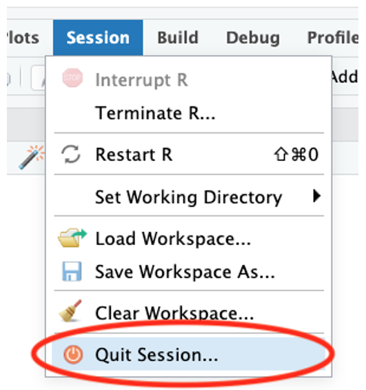

# RStudio

RStudio can be started or accessed in various ways:


- Using Hydra's node(s)
- Using the RStudio server

## RStudio on Hydra's Nodes

There are two ways to start RStudio on Hydra's nodes, you can either run


1. the RStudio desktop, or
2. the RStudio server.


You can also use Hydra's RStudio Server.


#### Which version to use?


They are both full fledged RStudio, but


- the desktop will run on Hydra and display its output on your local machine using the X-Windows protocol: it can be slow and your local machine must support X (via a X server) and your connection must allow X tunneling.
- the server will run on Hydra and use a ssh tunnel on your local machine to allow you to run RStudio inside a browser.


### Running the Desktop


Log in Hydra via one of the login nodes, allowing X-tunneling and


- Start a X-capable interactive session with `qlogin` (**not** `qrsh`)
- Load the `tools/R/RStudio/desktop` module
- Start the desktop with `rstudio --no-sandbox --disable-gpu`
- When done
    - exit the RStudio desktop (File -> Quit Session)
    - terminate the interactive session with `exit`


###### Example:


```{.text title="On the login node"}
sylvain@login01% qlogin
Your job 2453968 ("QLOGIN") has been submitted
waiting for interactive job to be scheduled ...
Your interactive job 2453968 has been successfully scheduled.
Establishing /cm/shared/apps/uge/var/cm/qlogin_wrapper session to host compute-64-15.cm.cluster ...
Last login: Wed Jul  3 10:17:51 2024 from 192.168.92.121

sylvain@compute-64-15% ml tools/R/RStudio/desktop
Loading tools/R/RStudio/desktop/2024.04.2-764
  Loading requirement: tools/R/4.4.1

sylvain@compute-64-15% rstudio --no-sandbox --disable-gpu
```


and you should see on your machine, if the X tunnel is set right:





Note that the RStudio desktop does not work with the Windows `Xming` X-server, but works with Cygwin/X and WSL.


### Running the Server


Log in Hydra via one of the login nodes (no need to enable X-tunnel)


- Start an interactive session with `qrsh`
- Load the `tools/R/RStudio/server` module
- Start the server with `start-rstudio-server`
- Follow the instructions to
    - start the ssh tunnel on your local machine in a terminal window
    - point your browser to `localhost:NNNN`, where NNNN is the port number
- When done
    - exit RStudio in your browser
    - terminate the server as instructed in the window opened to Hydra
    - terminate the interactive session with exit


###### Example:


1. Start the server on an interactive node


```{.text title="On the login node"}
sylvain@login01% qrsh

sylvain@compute-64-16% module load tools/R/RStudio/server
Loading tools/R/RStudio/server/2024.04.2-764
  Loading requirement: tools/R/4.4.1

sylvain@compute-64-16% start-rstudio-server
start-rstudio-server: starting RStudio server on host=compute-64-16 and port=8787
  you need to create a ssh tunnel on your local machine with
    ssh -N -L 8787:compute-64-16:8787 sylvain@hydra-login01.si.edu

Point your browser to http://localhost:8787 on your local machine.
Use Control+C in this window to kill the server when done.

TTY detected. Printing informational message about logging configuration. Logging configuration loaded from '/etc/rstudio/logging.conf'. Logging to '/home/sylvain/.local/share/rstudio/log/rserver.log'.
TTY detected. Printing informational message about logging configuration. Logging configuration loaded from '/etc/rstudio/logging.conf'. Logging to '/home/sylvain/.local/share/rstudio/log/rsession-sylvain.log'.
```


- If you receive the error message "`[rserver] ERROR system error 98 (Address already in use);`",the TCP port is already in use by another user. Specify a different port in the range of 1025-65535 when starting the server. E.g., `start-studio-server -port 8890`


2. Start the ssh tunnel on your local machine


```{.text title="On your local machine, in a terminal"}
ssh -N -L 8787:compute-64-16:8787 sylvain@hydra-login01.si.edu
```


- the IP and port numbers - the string `8787:compute-64-16:8787` - are likely to be different, and
    - replace `sylvain` by your username on Hydra.


3. Start a browser on your local machine and go to


`http://localhost:8787`


you should see:


or


(yse your Hydra credentials).


- Use `start-rstudio-server -help` to see all the options,


##### Notes


You could run either, the server or the desktop, on a login node but we *strongly recommend* that you use instead an interactive node:


- processes running on a login node for a long time and consuming resources get slowed down and eventually killed, hence your RStudio might die before you're done.


There are resource limits on interactive sessions, tho,


Check the relevant documentation regarding the [Interactive Queue](../jobs/queues.md) under [Available Queues](../jobs/queues.md).


RStudio uses R version 4.4.1, not 4.4.0


- if you want to use R 4.4.1, load the `tools/R/4.4.1` module, since loading `tools/R` load version 4.4.0


The RStudio server is by default secured via normal authentication, but


- anybody who knows what port and tunnel you use could connect to *your* RStudio server (and will have access to all your files), hence
    - do not use the default port (8787), pick a number between 8000 and 9999,
    - log off the server when done and,
    - do not leave the server running when not needed.


Since only people w/ credentials on Hydra can start a ssh tunnel, you are not exposed to the wide world.


- If you logged off using the server log off button, and can't log back in:
    - kill and restart the server,
    - If this fails clear the browser cookies


##### **Temporary directories with R and RStudio**


- `R` and `Rstudio` may need temporary disk space, and in some cases a lot of it.
    - The default location is, on Linux systems like Hydra, `/tmp.`
    - See the documentation for the R function [tempdir()](https://stat.ethz.ch/R-manual/R-devel/library/base/html/tempfile.html) for how R determines the path of the per-session temporary directory.
        - if `/tmp` fills up, a lot of things stop to work, so we recommend that you use a different location for temporary file.
- The location where to store temporary files can be modified by setting the environmental variables [`TMPDIR` , `TMP` , and `TEMP`](https://stat.ethz.ch/R-manual/R-devel/library/base/html/tempfile.html).
    - For `RStudio`, this must be set in an `.Renviron` file, because the shell's environment in which you start the `RStudio` server process is not used.
    - The `.Renviron` file can be in your home directory or in the base of your `RStudio` Project directory.


```{.text title="Example .Renviron file setting TMPDIR"}
TMPDIR=/scratch/genomics/USER/PROJECT/tmp
```


where you replace USER and PROJECT by your username and a more specific project name respectively.

## Using the RStudio Server


#### Overview


Hydra now offers a dedicated RStudio Server for interactive running of R-based workflows using a familiar GUI.


Users can leverage this server to test, debug, and develop R based workflows using the interactive R Studio GUI (currently running R 4.5.2). By logging in with your Hydra account credentials, users will have access to the storage under /data, /scratch and /store. This server offers resources totaling 192 CPUs and 1.5 T of RAM.


#### Quick start


The R Studio environment is accessible directly via a browser, at https://galaxy.si.edu/R4


Just like the other components of Hydra, this server is only accessible from computers connected to Smithsonian networks (i.e., VPN, telework.si.edu, or on-site networks), not on the public internet. See below about remote access to the system.


1. Open https://galaxy.si.edu/R4 in a browser on a computer that has access to Hydra.
2. Log in with your Hydra username (all lowercase) and password. 

3. A web-based interface to a RStudio session running on the server opens. The interface is nearly identical to what you would use on your workstation. 
You can install packages, runs scripts, create R projects, etc. in the same way as your workstation. 

4. The "Files" tab shows Hydra's storage systems. You have access to Hydra's `/home`, `/scratch`, `/data`, etc. 
 You can use the RStudio Server interface to transfer files or use other file transfer tools. SeeFile transfers below. 

5. All computations are performed on the dedicated server. If you close the browser window, your R session continues so objects in memory are preserved and computations will continue. SeeR Sessionbelow.


#### Software specifications


The instance is running:


- R 4.5.2
- RStudio Server 2024.12.0+467


The version of R and RStudio Server is the same for all users. If these versions impact your use, let us know so we can evaluate the impact of that in future revisions to the system.


#### Hardware specifications


The dedicated RStudio Server node has:


- 192 CPU cores
- 1.5 TB of memory


While the server offers substantial resources, these are shared. Be mindful of resource usage and terminate idle R Sessions.


#### Remote access


The RStudio Server can be accessed directly from your browser if your computer has one of the VPN enabled that gives access to Hydra.


The Smithsonian Telework website, https://telework.si.edu, can be used to access Hydra without a VPN.


1. Log into[https://telework.si.edu](https://telework.si.edu)
2. In the text box in the top left of the window, under the Smithsonian logo, labeled "*Enter an internal resource*" enter:[https://galaxy.si.edu/R4](https://galaxy.si.edu/R4)and then press the enter/return key. 

3. The RStudio Server login page will open in the same way as if you were onsite.


#### RStudio Server vs. workstation


Using RStudio Server is nearly the same as running the standard workstation version of RStudio. Below is some information about how they differ.


##### **a. File transfer**


Your data must be transferred to/from Hydra to work on it - directories in `/homes, /data,` and `/scratch` are all available on this server. Note: `/store` is not available at this time. The Hydra storage guidance, quotas, and scrubber policies apply to data used through the dedicated RStudio server. 
In addition to the existing file transfer tools for Hydra (see the file transfer guide, quick start guide, and Globus), RStudio Server has built-in tools for file transfers. These built-in tools are best for small files or quick edits. For large files or large file sets consider other file transfer tools.


***Using RStudio Server's built-in tools***


- **Upload** from your computer to Hydra: use the “Upload” button in the Files tag. 

    - Only one file can be uploaded at a time. Create a zip archive on your computer to upload several files at once. RStudio Server with unzip them automatically when they’re received.
- **Download** from Hydra to your computer
    - Select the checkboxes for files and folders you want to download.
    - Click the “More” button.
    - Choose “Export…” 

    - In the pop-up window click the Download button to save to your computer. If multiple files or a folder was selected, it will be zipped automatically prior to download. 


##### **b. R Session**


Your R session will continue to run on the server when you close your browser window or log off your computer. Any analyses underway will continue and your memory will be preserved. To re-connect to your R session, log back in to the RStudio Server. This will work even if you log back on from a different computer. ***This allows you to start a long analysis on the server and then disconnect.***


##### Ending your R Session


When you have completed your work on the RStudio Server, please quit your R session to free resources for other users.****


Use “Quit Session...” from the Session or File menu.





##### One R Session limit


RStudio Server only allows one R session per user. This means that if you have an existing session and log in to the server via a browser, control of that session will switch to the current browser. There is not a way to have more than one browser window open with different RStudio and R sessions.


One workaround is to use the “Background Jobs” tab to run multiple analyses at one time. See https://docs.posit.co/ide/user/ide/guide/tools/jobs.html


##### **c. Installing Packages**


You can install R Packages on the RStudio server in the same way you would on the desktop version of RStudio without needing administrative rights to the RStudio Server.


Packages are installed in your personal Library: `~/R/x86_64-redhat-linux-gnu-library/4.5`


⚠️Each user has a personal Library. When one user installs packages in their library, these packages are not available to others.


⚠️ All R packages on Linux systems will be compiled from source. This is unlike Windows or Mac where they are typically downloaded as pre-compiled binaries.


Use the `Ncpus` option in `install.packages()` to speed up installs. For example, this will use 8 CPUs to install the given package and its dependencies in parallel.


```{.text title="install.packages() with multiple CPUs"}
install.packages("seqinr", Ncpus = 8)
```


`Ncpus` is also an option for installing Bioconductor packages:


```{.text title="Installing Bioconductor packages with multiple CPUs"}
BiocManager::install("phyloseq", Ncpus = 8)
```


##### **d. Packages Requiring Newer GCC**


**Problem Summary**


Some CRAN and Bioconductor packages (e.g. ade4, seqinr) require a newer GCC toolchain than the system default. Attempting to install these packages may result in errors such as missing GLIBCXX symbols or OpenMP-related compilation failures.


**Root Cause**:


- Mixed compiler configuration between ~/.Renviron and ~/.R/Makevars
- Mismatched GCC versions across compiler variables
- R packages require a single, consistent compiler toolchain during build and runtime


**Follow the steps below update the GCC compiler variables and solve the install issues:**


**Step 0 – Remove Old Configuration**


If you previously set compiler paths in ~/.Renviron, remove the file before proceeding.


Run in the RStudio Terminal (not the R console):


```
rm ~/.Renviron 
```


**Step 1 – Create Makevars**


Run the following commands in the RStudio Terminal:


```
mkdir -p ~/.R 
nano ~/.R/Makevars 
```


Below is an example Makevars file for GCC 14.2.0:


```
CC = /share/apps/tools/gcc/14.2.0/bin/gcc 
CXX = /share/apps/tools/gcc/14.2.0/bin/g++ 
CXX11 = /share/apps/tools/gcc/14.2.0/bin/g++ 
CXX14 = /share/apps/tools/gcc/14.2.0/bin/g++ 
CXX17 = /share/apps/tools/gcc/14.2.0/bin/g++ 
FC = /share/apps/tools/gcc/14.2.0/bin/gfortran 
F77 = /share/apps/tools/gcc/14.2.0/bin/gfortran 

CFLAGS = -O2 -g -fopenmp -fpic 
CXXFLAGS = -O2 -g -fopenmp -fpic 
CXX11FLAGS = -O2 -g -fopenmp -fpic 
CXX14FLAGS = -O2 -g -fopenmp -fpic 
CXX17FLAGS = -O2 -g -fopenmp -fpic 
FFLAGS = -O2 -g -fpic 
FCFLAGS = -O2 -g -fpic 
```


If you need a different version, replace the 14.2.0 above with one of the other versions available on Hydra.


**GCC Versions Available**


- 9.2.0, 9.3.0, 10.1.0 – OpenMP 4.5
- 11.2.0, 12.2.0 – OpenMP 5.0
- 13.2.0, 14.2.0, 15.2.0 – OpenMP 5.1


Packages such as ade4 require GCC >= 10.1.0.


-------


Save and exit: Ctrl+O, Enter, Ctrl+X


**Step 2 – Restart R**


In RStudio, select Session → Restart R. Compiler changes will not take effect until R is restarted.


**Step 3 – Install Packages**


Install packages using standard commands:


```
install.packages(""ade4"") 
BiocManager::install(""PackageName"") 
```


**Reverting to System GCC**


Remove the Makevars file:


```
rm ~/.R/Makevars 
```


Then restart R.


**Troubleshooting**


- GCC mismatch errors: ensure no compiler variables exist in ~/.Renviron
- GLIBCXX errors: rebuild packages using a newer GCC
- Package loads fail: verify all compiler variables point to the same GCC path

## Dedicated RStudio Server

Accessing the RStudio Server is explained here.
