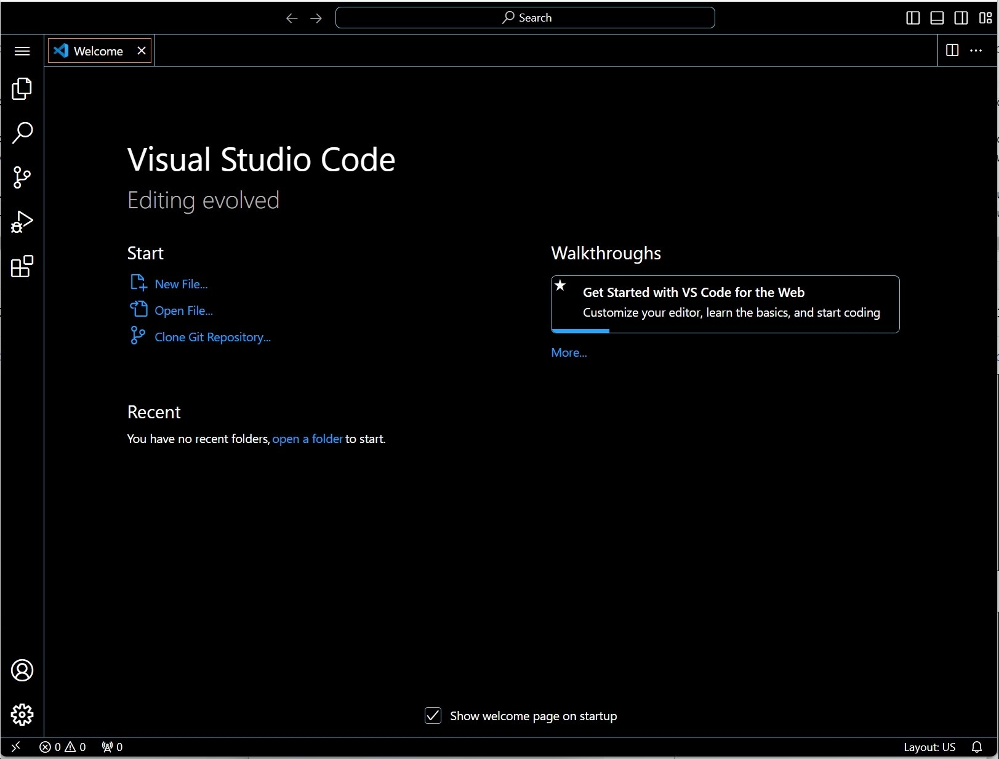
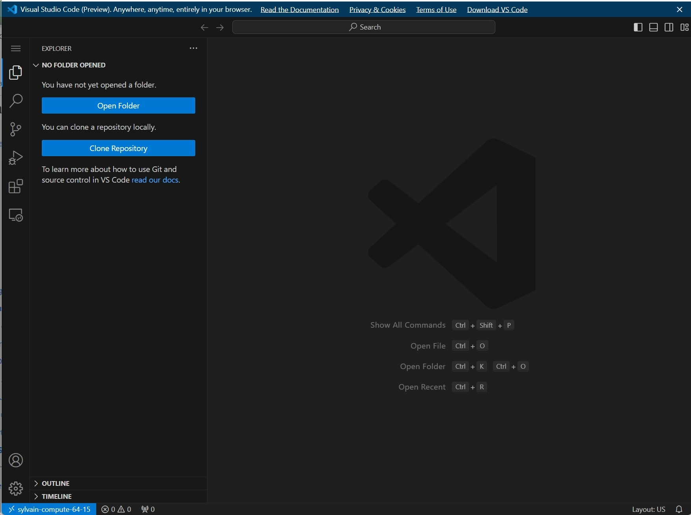

# VS Code

VS Code reaches Hydra three ways. Remote-SSH connects the VS Code on your own machine to a login node, which is fine for editing files and nothing more. The login-node limits apply to anything it runs. The other two run VS Code itself on a compute node and show it in your browser, through an ssh tunnel or through a tunnel that Microsoft relays.

| Way | Where VS Code runs | Needs | Use for |
|---|---|---|---|
| Remote-SSH | your machine; a helper on a login node | the Remote-SSH extension | editing files; nothing that computes |
| VS Code server | a compute node, shown in your browser | an ssh tunnel from your machine | any interactive work |
| VS Code tunnel | a compute node, shown in your browser | a GitHub account; no ssh tunnel | the same, and from telework.si.edu |

The `tools/vscode` module also provides `vscode-desktop`, a windowed VS Code over X11, which needs an X server that supports it and is slow. The module's `start-vscode` script offers desktop, server and tunnel at a prompt.

## Use Remote-SSH from your own VS Code

1. Install VS Code and the **Remote-SSH** extension on your machine.
2. **Remote-SSH: Connect to Host**, enter `USERNAME@hydra-login01.si.edu`, and log in with your Hydra password.

!!! warning "Remote-SSH runs its helper on a login node"

    Anything you start from its terminal is under the login-node limits. For anything that computes, submit a job or open an [interactive session](qrsh.md).

## Start a VS Code server on a compute node

1. On a login node, start an [interactive session](qrsh.md), then load the module and start the server:

    ```console
    $ qrsh
    $ module load tools/vscode
    $ start-vscode-server
    start-vscode-server: starting vscode server on host=compute-64-15 IP=192.168.92.85 and port=8000
      you need to create a ssh tunnel on your local machine with
        ssh -N -L 8000:192.168.92.85:8000 USERNAME@hydra-login01.si.edu
      in a terminal window.
    ...
    Web UI available at http://192.168.92.85:8000?tkn=xxxxxxxx-xxxx-xxxx-xxxx-xxxxxxxxxxxx
    ```

    The script prints the tunnel command and waits. Press Enter to start the server. The token changes every start. `-token STRING` fixes it and `-no-token` removes it. `start-vscode-server -help` lists the options.

2. On your own machine, open the tunnel the script printed, in a terminal you leave alone:

    ```console
    $ ssh -N -L 8000:192.168.92.85:8000 USERNAME@hydra-login01.si.edu
    ```

3. In a browser, open `http://localhost:8000?tkn=TOKEN` with the token from step 1. Use `localhost`. The `192.168.…` address the server prints is reachable only inside the cluster.

    

4. When done, `Ctrl-C` in the server's window, `Ctrl-C` in the tunnel's terminal, then `exit` the session.

## Use a VS Code tunnel

A tunnel registers the compute node with Microsoft's relay under a name, and you open `vscode.dev` with that name. It needs a GitHub account for authentication. SI Microsoft accounts fail because of SI's MFA setup.

1. In an interactive session, load the module and start the tunnel:

    ```console
    $ qrsh
    $ module load tools/vscode
    $ start-vscode-tunnel
    start-vscode-tunnel: starting a tunnel, name: USERNAME-compute-64-15
      to access the tunnel, point your browser to https://vscode.dev/tunnel/USERNAME-compute-64-15 on your local machine.
    ...
    ? How would you like to log in to Visual Studio Code? ›
       Microsoft Account
    [] GitHub Account
    To grant access to the server, please log into https://github.com/login/device and use code ABE4-F1A6
    ```

2. Press Enter when the script asks, to start the tunnel. Then choose **GitHub Account** with the arrow keys, open the device-login URL in a browser, and enter the code.

3. Open `https://vscode.dev/tunnel/USERNAME-compute-64-15` in a browser. Choose **GitHub** if it asks how to authenticate.

    

4. When done, `Ctrl-C` in the tunnel's window, then `exit` the session.

If the tunnel fails at start with `error failed to lookup tunnel: connection error`, run `host use.rel.tunnels.api.visualstudio.com` once, which returns an address, and start the tunnel again. To reset the stored credentials, delete `~/.vscode/cli/token.json`.

## Further reading

- [Start an interactive session](qrsh.md) for the session and tunnel this page builds on
- [Find and load software](../software/modules.md) for the compilers and interpreters VS Code will find on the node
