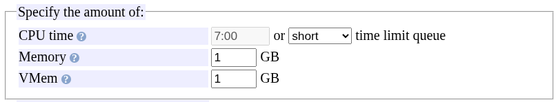
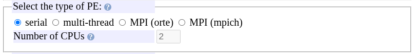
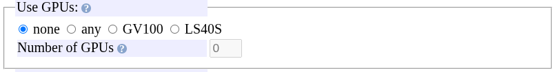
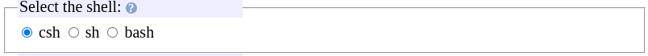
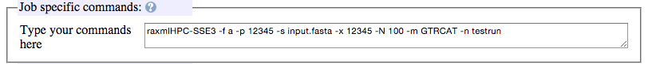
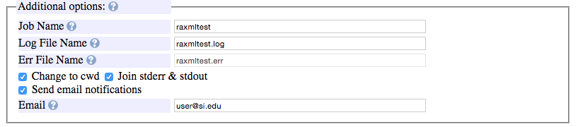

# QSub Generator

The QSub Generator is a web form that writes a job file. You fill in the resources the job needs and the commands it runs. The form produces a `.job` file with the matching embedded directives, which you upload to Hydra and submit with `qsub`.

Open <https://hydra.si.edu/tools/QSubGen/> from the SI network, the SI VPN, or telework.si.edu. Use Chrome or Firefox. Safari is not supported. The question-mark icon next to each field explains it and its format.

## Fill in the form

### Time and memory

**CPU time** is the CPU time allowed to the job, per CPU. Type a value or pick one from the menu, which sets the text box. The job is killed when it reaches this limit.

CPU time counts only the time a processor is busy with the job. Elapsed time is the time on the clock from start to finish. A job that waits on files uses less CPU time than elapsed time. A job on several CPUs adds up the time of each, so four CPUs that are each busy for 9 seconds use 36 seconds of CPU time. For a job with several CPUs the scheduler multiplies the CPU limit by the number of CPUs and leaves the elapsed-time limit alone. See [Time classes](queues.md#time-classes).

**Memory** is the maximum memory the job uses, per CPU. Some programs come with a memory estimator. The form links to one for RAxML.

**VMem** is the virtual-memory limit. It is set to the memory value unless you change it.

### Parallel environment

Choose serial (one CPU), multi-thread (several CPUs on one node) or MPI (CPUs spread over nodes), and the number of CPUs. The program's documentation and `module help MODULE` say which kinds of parallelism it supports. See [Parallel jobs](parallel.md).

### GPUs

Choose whether the job uses GPUs, which type, and how many. The program must be written to use a GPU. See [GPUs](../software/gpus.md).

### Shell

Choose `sh`. The job files on this site are written for it, and `csh` scripts cannot catch the signals at the time limits.

### Modules

Type the start of a program name to see the matching modules, and pick the one to load. A module without a version, such as `bioinformatics/raxml`, loads the default version. See [Modules](../software/modules.md).

### Commands

Enter the commands the job runs, starting with the executable name and followed by its options and input files. `module help MODULE` on Hydra prints the executables a module provides. For an MPI job, start the line with `mpirun -np $NSLOTS`.

### Additional options

| Field | Effect |
|---|---|
| Job Name | Name shown by `qstat`. No spaces. |
| Log File Name | File for standard output. Filled in from the job name. |
| Error File Name | File for standard error when output and error are not joined. Filled in from the job name. |
| Change to CWD | Run the job, and write the log, in the directory you submit from. Leave this checked. |
| Join stderr & stdout | Write all output to the log file. Check this. |
| Send email notifications | Email when the job starts and ends. |
| Email | Address for the notifications. |

## Check, save and submit

1. Click **Check if OK**. The generated script appears in the grey box, with the total CPU time and memory requested above the **Save it** button.
2. Click **Save it** to download the `.job` file.
3. Copy the file to your working directory under `/scratch` or `/data` on Hydra (see [Data transfer](../data-transfer/index.md)).
4. Log in and submit it with `qsub FILE.job`, as in the [Quick start](../getting-started/quick-start.md).

To change the file afterwards, edit it in a text editor on Hydra. [Job script reference](job-scripts.md) describes every directive it contains.
