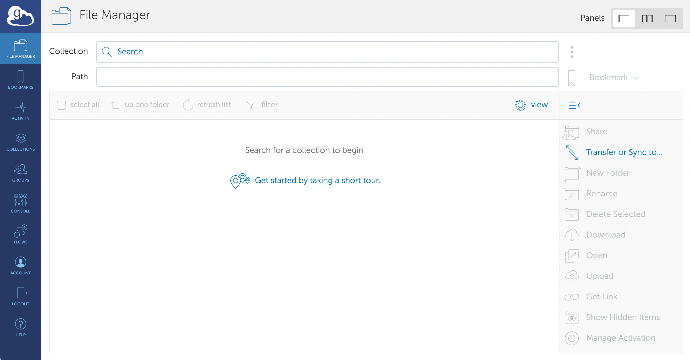
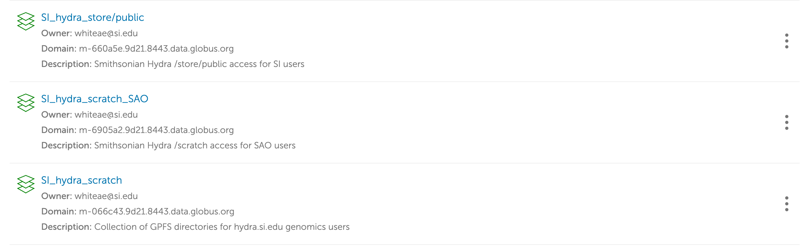
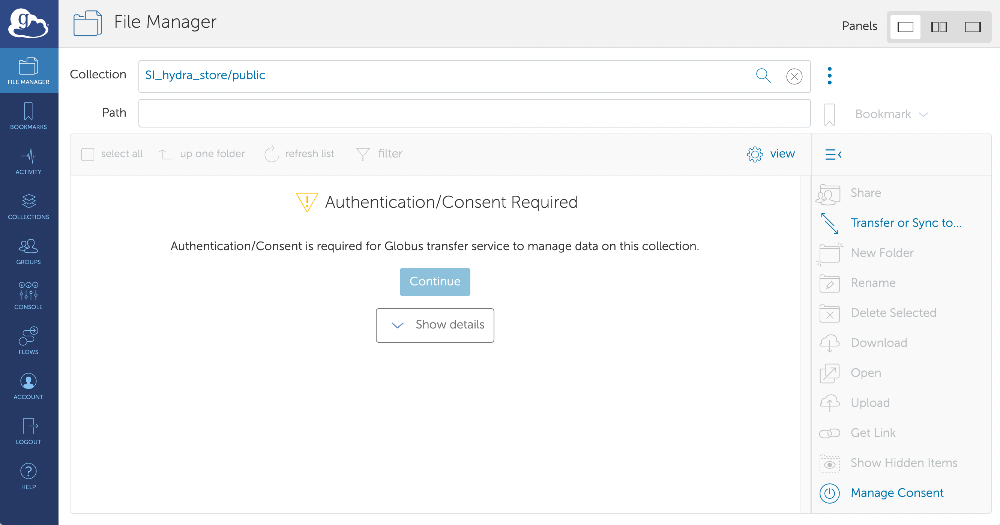
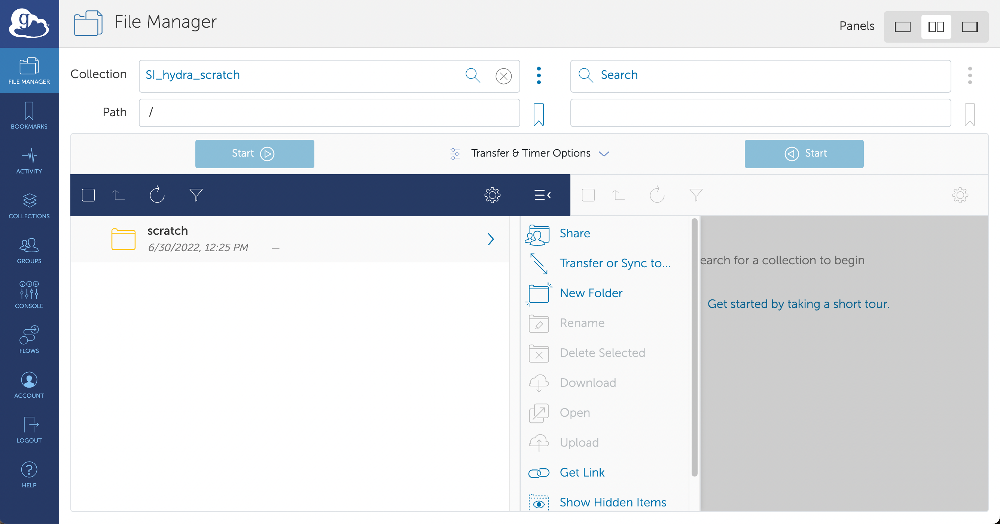
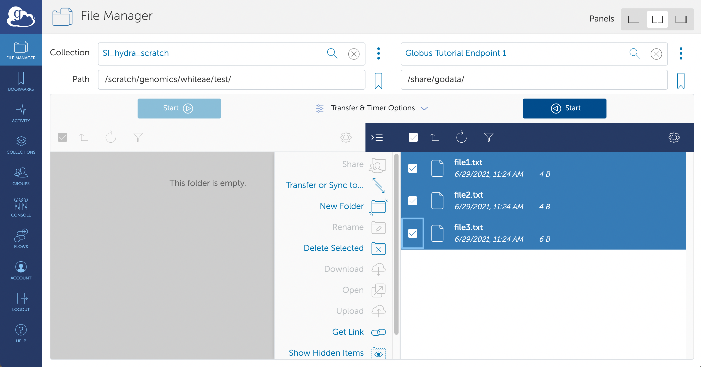
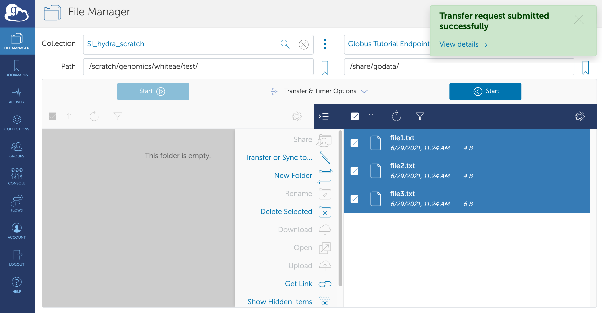
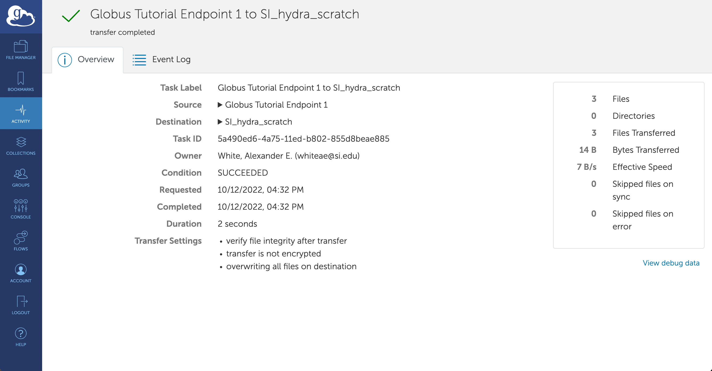

## Introduction

Globus is a web-based file transfer service that allows SI researchers to move large amounts of data between storage locations served up by endpoints connected to the Globus network. This service is particularly useful for transferring data to storage devices connected to Hydra. Data can originate from storage located within the SI network or from outside the network where data is served on another Globus endpoint. This service can be used both in a simple manner to move files from one storage device to another or in a more sophisticated set up where automatic data transfers are performed on a scheduled basis. Globus has sophisticated capabilities - below we review the procedure for logging in, a quick review of simple features for making data transfers, and a glossary of important concepts. Globus provides a number of more in depth tutorials at [https://docs.globus.org/how-to](https://docs.globus.org/how-to).

## Getting started with Globus on Hydra

### Using the proper credentials

First, you will need to login to the Globus web app. Navigate to [app.globus.org](https://app.globus.org) and select the appropriate institution from the drop down menu. For Hydra users located at the Astrophysical Observatory in Cambridge, please use select “Harvard University” and proceed with your Harvard institutional credentials. For all other hydra users please select "Smithsonian Institution" as shown below.

|  |
| --- |
| The Globus login page |

Select continue and you will be routed to a secure login page hosted by SI. Enter your SI account name (the portion of your email address before '\@si.edu') and password, NOT your hydra credentials. If you have any trouble at this stage, you will need to follow the instructions to contact the OCIO Service Desk.

|  |
| --- |
| Use your regular SI credentials here |

### Linking to existing accounts and completing signup

After you login, you will be asked whether you'd like to link to an existing Globus account - if you are already a Globus user you can do this. If you are logging in for the first time, select continue. You will then be asked to complete your signup by providing some additional information. Please fill out the form and continue to the Globus web app.

## Accessing your data on Hydra

All of your activity on Globus can be managed using your web browser with the Globus web app. You can move data between two different Globus "collections" (i.e. hosted storage locations), manage your Globus collections and how they are shared with collaborators, and run automated data transfer workflows with more complex stipulations. All of these features are accessible by navigating to the proper tab on the left side of your browser window in the Globus web app.

Below we will briefly describe how to access your data on Hydra using the File Manager.

** *Note* ** *Your permissions to access and view files in this file manager operates exactly as it does when accessing hydra in the terminal. You will not be able to view folders and files for which you do not have read/write permissions. Your Globus account is automatically updated with your Hydra user read/write permissions once you authorize access to any of the collections described below.*

|  |
| --- |
| You will navigate to your Hydra storage in the File Manager |

### Navigating to your files

At the top of the page, select the "Collection" search bar, and search using the keyword "Smithsonian".

|  |
| --- |
| Search for SI Hydra collections here |

In the results you will see the Smithsonian Hydra collections (beginning with "SI_hydra_") that are currently managed by Hydra admins.

|  |
| --- |
| Collections connected to Hydra storage |

Select the appropriate collection according to your needs. Most users will need to access one of the scratch collections, either `SI_hydra_scratch` or `SI_hydra_scratch_SAO`. All individual user directories will be accessible via these collections. A small number of users may need to access storage devices at the `SI_hydra_store/public` collection.

The first time you select a collection, you will see a message requesting authorization for Globus to access and manage your data at that location. "Continue" and "allow" to proceed and navigate to your files.

|  |  |
| --- | --- |

Once you land at the root path of your collection (depending on the collection, e.g., `/scratch/`) you can navigate to your user directory as you would in any other file explorer or finder window. Many users will navigate to their user directory in `/scratch/genomics/` or `/scratch/sao/`. You will be able to view all other directories below the root path just as you would when connecting to Hydra via the terminal, but you will only be able to modify or transfer files or directories for which you already have read/write permissions with your Hydra user account (see note above).

|  |
| --- |
|  |

### Transferring data

At this point you are able to access your files, but to transfer files or to bring files from another source, you need to navigate to another Globus collection. In the top right-hand corner of the browser window, select the middle pane of the 3 paneled illustration marked `Panels`.

|  |
| --- |
|  |

You will notice another Collection search bar is now available. Here is where you will navigate to either the source or destination of the files that you will transfer to/from your Hydra storage. Most collections that are publicly searchable will still have restrictions for access or for read/write permissions. For a tutorial, Globus makes `Globus Tutorial Endpoint 1` available to transfer small .txt files for testing. To test transfer these files, search for `Globus Tutorial Endpoint 1` and select this collection. You will not see any files in the root folder. Replace the `/~/` path with `/share/godata/` and you will see 3 .txt files available to transfer.

|  |
| --- |
|  |

Once you select these 3 files you can select the start button to initiate a test transfer (the arrow of the start button will show the direction of file transfer). In the image above, 3 files in the `Globus Tutorial Endpoint 1` collection are selected to transfer to the `SI_hydra_scratch` collection in the `/scratch/genomics/whiteae/test/` directory. Select the start button and you will see a message appear that a transfer request was submitted successfully. You will likely receive a notice of a successful transfer in your \@si.edu email inbox within a minute.

|  |
| --- |
|  |

You can monitor your transfers by navigating to the "Activity" tab on the left side of the browser window. Here you will see the recent transfer named `Globus Tutorial Endpoint 1 to SI_hydra_scratch`. Select the transfer and you can inspect transfer details and monitor progress for ongoing transfers.

|  |  |
| --- | --- |

### Moving files to/from your computer

In order to move files to/from a desktop or laptop, you need to set up Globus Connect Personal on your personal machine. On any machine where you have administrative permissions, please refer to the Globus docs which provide in-depth instructions for installing and configuring Globus Connect Personal for [Mac OS X](https://docs.globus.org/how-to/globus-connect-personal-mac), [Windows](https://docs.globus.org/how-to/globus-connect-personal-windows), and [Linux](https://docs.globus.org/how-to/globus-connect-personal-linux) machines. Once configured, you will be able to navigate to your Globus Connect Personal collections and use them as indicated above.

On Smithsonian administered machines, you will need to download Globus Connect Personal via the Software Center.

** *Note* ** *You will not be able to connect to the Globus Personal Connect client while connected to the SI-Internal and SI-Staff networks. You must connect to the Eduroam network instead. This is due to firewall restrictions that prevent a connection to the Globus client on SI networks.

## Glossary of key concepts:

###### Definitions from [https://docs.globus.org/how-to/get-started/](https://docs.globus.org/how-to/get-started/)

**Collection**

> A collection is a named location containing data you can access with Globus. Collections can be hosted on many different kinds of systems, including campus storage, HPC clusters, laptops, Amazon S3 buckets, Google Drive, and scientific instruments. When you use Globus, you don’t need to know a physical location or details about storage. You only need a collection name. A collection allows authorized Globus users to browse and transfer files. Collections can also be used for sharing data with others and for enabling discovery by other Globus users. Globus Connect is used to host collections.

**Fire-And-Forget Data Transfer**

> After you request a file transfer, Globus takes over and does the work on your behalf. You can navigate away from the File Manager, close the browser window, and even logout. Globus will optimize the transfer for performance, monitor the transfer for completion and correctness, and recover from network errors and collection downtime.
> 
> 
> The Globus service routinely achieves high availability, providing nearly uninterrupted oversight of data transfers taking place on much less reliable networks and collection hosts. When a problem is encountered part-way through the transfer, Globus resumes from the point of failure and does not retransmit all of the data specified in the original request.
> 
> 
> Globus can handle extremely large data transfers, even those that don’t complete within the authentication expiration period of a collection (which is controlled by the collection administrator). If your credentials expire before the transfer completes, Globus will notify you to re-authenticate on the collection, after which Globus will continue the transfer from where it was paused.

**Endpoint**

> An endpoint is a server that hosts collections. If you want to be able to access, share, transfer, or manage data using Globus, the first step is to create an endpoint on the system where the data is (or will be) stored.
> 
> 
> Globus Connect is used to create endpoints. An endpoint can be a laptop, a personal desktop system, a laboratory server, a campus data storage service, a cloud service, or an HPC cluster. As explained below, it’s easy to set up your own Globus endpoint on a laptop or other personal system using Globus Connect Personal. Administrators of shared services (like campus storage servers) can set up multi-user endpoints using Globus Connect Server. You can use endpoints set up by others as long as you’re authorized by the endpoint administrator or by a collection manager.
