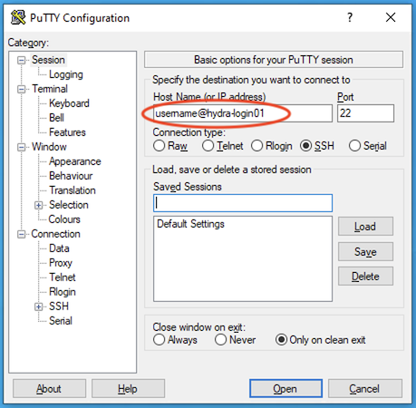

- [Introduction](logging-into-hydra.md)
    - [Requesting Access](logging-into-hydra.md)
- [Logging in From a Computer Running MacOS](logging-into-hydra.md)
- [Logging in From a Computer Running Windows](logging-into-hydra.md)
- [Logging in From a Computer Running Linux](logging-into-hydra.md)
- [Logging in via telework.si.edu](logging-into-hydra.md)


# Introduction


::: {.note title="Note:"}
The material on this page is part of the Quick Start Guide and is not exhaustive. For more details, please see the [Reference Pages](../reference-pages.md).
:::


- Access to the Hydra cluster is through a remote terminal connection:
    - If you are using a Mac you will use the built-in `Terminal` App,
    - for Windows, you can use the ssh client integrated into new versions of the Windows command prompt, the program `PuTTY`, or another ssh client
    - for Linux, use `ssh`.
    - you can also access Hydra via telework.si.edu, (see below)
- When you received your email from the Hydra admin team with your user account information it contained your `username` and a link to reset your initial `password`.
    - You will need your username to reset your initial password,
    - and either
        - enable VPN,
        - log into [telework.si.edu](http://telework.si.edu), or
        - use a "trusted" computer to connect to the self-serve password change/reset page.
- There are two computers (known as login nodes) that you can log into for Hydra access:
    - `hydra-login01.si.edu,` and
    - `hydra-login02.si.edu`


You can use either one.


::: {.note title="Note:"}
To connect to Hydra you must either:


- use SI's or SAO/CfA's VPN, or
- use `telework.si.edu` , (see below), or
- use a "*trusted*" computer: one connected to the Smithsonian network - SI or SAO/CfA


To prevent brute force hacking, **users accounts are locked for 15 minutes after 3 failed login attempts:**


- If you mistype your password 3 times, simply wait for at least 16 minutes and try again.
:::


### Requesting Access


- SAO users should follow the instruction posted on the [CF: Services: High Performance Computing web page](https://www.cfa.harvard.edu/cf/services/cluster/),
- Non-SAO users should fill out this [online form](https://smithsonianprod.servicenowservices.com/si?id=sc_cat_item&sys_id=962e05331b96e05078932f41f54bcb3b&sysparm_category=8b5b9d421b601410520ba82eac4bcb65) for a new Hydra account and this [online form](https://smithsonianprod.servicenowservices.com/si?id=sc_cat_item&sys_id=cd8bcf38dbaec810faac7c031f961992&sysparm_category=8b5b9d421b601410520ba82eac4bcb65) for a VPN account.


# Logging in From a Computer Running MacOS


1. Open the Terminal application by going to /Applications/Utilities and finding Terminal. 
    1. You can get to the Utilities folder by going to the Go menu in the Finder and choosing Utilities
2. At the command prompt (that ends with `%`by default on newer versions of macOS) type in this command, replacing `username` with your hydra username (all lower case) from you welcome email:


```
% ssh username@hydra-login01.si.edu
```


 The first time you login you will see this message, type `yes` to continue:


```
The authenticity of host 'hydra-login01.si.edu' can't be established.
RSA key fingerprint is ...
Are you sure you want to continue connecting (yes/no)? yes
```


You will get a password prompt where you should enter the password you selected when using self-serve password reset page (check [here how to change or reset your password](changing-or-resetting-your-hydra-password.md)).


 Note: no text, stars or bullets will appear when you type in your password.


```
Warning: Permanently added 'hydra-login01.si.edu' (RSA) to the list of known hosts.
Password: 
[username@hydra-login01 ~]$ 
```


You are now logged into Hydra!


# Logging in From a Computer Running Windows


Recent releases of Windows 10 (version 1803 and newer) come with a ssh client that is available through the Command Prompt or PowerShell.


1. Open Command Prompt or PowerShell which can be found by searching the Start menu.
2. At the command prompt type in this command, replacing `username` with your hydra username (all lower case) from you welcome email:


```
C:\Users\WindowsUsername> ssh username@hydra-login01.si.edu
```


 The first time you login you will see this message, type `yes` to continue:


```
The authenticity of host 'hydra-login01.si.edu' can't be established.
RSA key fingerprint is ...
Are you sure you want to continue connecting (yes/no)? yes
```


You will get a password prompt where you should enter the password you selected when using self-serve password reset page (check [here how to change or reset your password](changing-or-resetting-your-hydra-password.md)).


 Note: no text, stars or bullets will appear when you type in your password.


```
Warning: Permanently added 'hydra-login01.si.edu' (RSA) to the list of known hosts.
Password: 
[username@hydra-login01 ~]$ 
```


The change in the command prompt from the Windows prompt `C:\Users\...>` to `[useranme@hydra-login01 ~]$` shows that you are now connected to Hydra.


If your release of Windows 10 does not have ssh (you get an error message like: `'ssh' is not recognized as an internal or external program...` ), we recommend using the program [PuTTY](http://www.chiark.greenend.org.uk/~sgtatham/putty/download.html) to connect to Hydra.


The program to download is [putty.exe](http://the.earth.li/~sgtatham/putty/latest/x86/putty.exe).


1. The downloaded putty.exe can be run without running a Windows installer program.
2. Start PuTTY and in the Configuration screen that opens enter `username@hydra-login01.si.edu` in the `Host Name` text box (replacing `username` with your hydra username (all lower case) from you welcome email), then press `Open`


 
 
 The first time you connect you will get a warning about the Server's host key, choose the "Yes" option 
 


1. A terminal window will open.


At the `Password:` prompt use the password you selected when using self-serve password reset page (check [here how to change or reset your password](changing-or-resetting-your-hydra-password.md)).


 Note: no text, stars or bullets will appear when you type in your password.


```
username@hydra-login01's password: 
[username@hydra-login01 ~]$
```


You are now logged into Hydra!


# Logging in From a Computer Running Linux


- From a trusted computer (i.e. most CF- or HEA-managed machines, or after enabling SI's or SAO/CfA's VPN) use`ssh` to connect to one of the two login nodes:
    - `ssh hydra-login01.si.edu`


*or*


- 
    - `ssh hydra-login02.si.edu`


 Linux (and Mac) users can enable password-less login into Hydra using the Public key authentication.


- Follow the instructions[here](http://www.linuxproblem.org/art_9.html) or Google "passwordless ssh mac" or "passwordless ssh mac" and follow the instructions.


# Logging in via telework.si.edu


The [telework.si.edu](https://telework.si.edu/) is available from inside the Smithsonian network as well as remotely. There is a web-based terminal program available on telework.si.edu to access Hydra.


After logging in, expand the "IT Tools" section choose "Hydra".


[](https://github.com/SmithsonianWorkshops/Hydra-introduction/blob/master/images/telework-hydra-icon.png)


Choose one of the "Web SSH terminal (WeTTY)" links to start the web terminal connection to one of the login nodes.


At the `login:` prompt, enter your Hydra username and at the `password:` prompt, enter your Hydra password.
