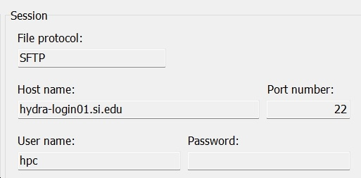

::: {.note title="Note:"}
The material on this page is part of the Quick Start Guide and is not exhaustive. For more details, please see the [Reference Pages](../reference-pages.md).
:::


# Introduction


This page explains how to copy files for your analysis to and from Hydra.


- File transfers can be done either
    - through command line, using `scp`, `rsync`or `sftp`, `or`
    - using a GUI application like [FileZilla](https://filezilla-project.org/), [WinSCP](https://winscp.net/eng/index.php) etc. That is, any tool that implements the `scp`or `sftp`protocol.


 While the graphical interface of these programs is convenient, we recommend the command line tools `scp`, `rsync` or `sftp` for greater control and reliability, *especially for large transfers.*


- Transfers to Hydra can only be initiated from "*trusted*" computers (i.e., you may need to enable VPN);
- File transfers using the [telework.si.edu](https://telework.si.edu) require the use of a cloud service or use of an intermediate trusted computer (see instructions on using [ffsend](https://confluence.si.edu/display/HPC/Using+Firefox+Send) or [rclone](https://confluence.si.edu/display/HPC/Using+rclone));
- Transfers *from* Hydra to your local machine are not limited to trusted destinations.


 Large files should always be copied directly to the `/data` or `/scratch` directories, not to your home directory (`/home`) because of space limitations.


Consult [the page about disk space and usage](https://confluence.si.edu/display/HPC/Disks+Space+and+Usage) for more about data storage on Hydra.


# Additional Details


The following quick start instructions show


- how to configure `FileZilla`for file transfers,
- how to use `WinSCP`, and
- a short introduction to `scp`, `rsync` or `sftp`.


## Using FileZilla


1. "FileZilla Client" is available for Mac, Windows and Linux systems. 
Mac screenshots are shown here, but use on other systems is similar.
2. Open the FileZilla application.
3. In the Quickconnect toolbar at the top of the window enter:
    1. Host: `hydra-login01.si.edu` or `hydra-login02.si.edu`
    2. Username: your Hydra username
    3. Password: your Hydra password
    4. Port: 22 

4. Press the "Quickconnect" button to start the connection. 
 
 If you get a warning about Saving passwords, choose "Do not save Passwords" and then the OK button. 
 
 
 If you get a warning about Unknown host key, click the "Always trust..." checkbox and then the OK button. 

5. The files listed on the left side of the window are on your local computer, those on the right are on Hydra.
    1. Use the file tree on the left to navigate to the directory with your files to upload
    2. For the destination on Hydra, enter the path of your destination in the "Remote site:" text box
    3. Drag files from the left to a directory on the right side to upload them 


## Using WinSCP


- WinSCP is available for Windows and is a GUI that performs `scp/sftp` and can be downloaded from [here](https://winscp.net/eng/download.php).
- Open the WinSCP application and use:
    1. Protocol: SFTP
    2. Host name: `hydra-login01.si.edu` or `hydra-login02.si.edu`
    3. Port: 22
    4. Username: your Hydra username
    5. Password: your Hydra password (or leave blank)





- Click the Login button, and enter your password:


- WinSCP can be configured, via its settings, to
    - show two windows: local and remote files ("commander mode"),


- 
    - or only the remote files ("explorer" mode).


- 
    - WinSCP layout can be re-arranged, so your may look somewhat differently.
- Navigate via the GUI to the location of the source files and to the location of the destination, or type the full path in the "Address" and then
    - drag and drop the files you want to copy, selecting a slew of them, or only one at a time.
- In the "explorer" mode, use Windows' File Explorer to navigate your local disk.


## Using SCP


The command `scp` is available on any Linux, Windows (as of Windows 10) or Mac machine.


- To access it from a Mac, start Terminal to get a Unix prompt.
- On Windows open a Command Prompt or PowerShell session from the Start menu.


Use the command `cd` to go to where the files you want to copy are.


```{.text title="You can copy a local file with:"}
scp myfile remuser@hydra-login01.si.edu:/path/to/dest/ 
```


where:


- `myfile` is the file name you want to copy on your (local) machine,
- `remuser` is your Hydra username,
- `/path/to/dest` is the directory specification where you want the file copied (it must exists), like `/scratch/genomics/username/big/stuff`


To copy to Hydra:``


```{.text title="You can copy multiple files with:"}
scp myfile1 myfile2 remuser@hydra-login01.si.edu:/path/to/dest/ 
scp myfile* remuser@hydra-login01.si.edu:/path/to/dest/ 
```


The command scp always copy the file(s), the option '`-p'` (like in `scp -p`) will preserve the date information of the file(s) copied.


And to copy from Hydra,:


```{.text title="To copy from Hydra"}
scp remuser@hydra-login01.si.edu:/path/to/location/myfile .
```


or, if you want to use a wildcard in the file name specification, use quotes like in:


```{.text title="You can use wildcards (remote location), as follows:"}
scp 'remuser@hydra-login01.si.edu:/path/to/location/myfile*' .
```


To learn more about `scp`, read the manual page (`man scp` on Linux or Mac systems). The flag `-p`will preserve the file(s) timestamps, like in


`scp -p myfile* remuser@hydra-login01.si.edu:/path/to/dest/`


## Using RSYNC


The command `rsync` is available on any Linux or Mac machine, it is not available on Windows systems. To access it from a Mac, start a terminal to get a Unix prompt.


Rsync synchronizes files between two hosts (machines), so it will not copy files that exists already and are up-to-date: it will copy a file if the one on the source location is older than the one on the destination.


Use the command `cd` to go to where the files you want top copy are. To copy to Hydra:


```{.text title="Examples of copying to Hydra:"}
rsync myfile remuser@hydra-login01.si.edu:/path/to/dest/
rsync myfile1 myfile2 remuser@hydra-login01.si.edu:/path/to/dest/
rsync myfile* remuser@hydra-login01.si.edu:/path/to/dest/
```


And to copy from Hydra:


```{.text title="From Hydra to your local machine:"}
rsync remuser@hydra-login01.si.edu:/path/to/location/myfile .
rsync 'remuser@hydra-login01.si.edu:/path/to/location/myfile*' .
```


The difference with `scp`, is tha`t rsync will only copy what is new, so use:`


```{.text title="so you can do:"}
rsync * remuser@hydra-login01.si.edu:/path/to/dest/
```


to synchronize the content of the current working directory.


Use the option '`-n`' (like in `rsync -n`) to check what `rsync` will do (it will list what will be copied, but not do it, aka 'dry run').


Three more useful options are:


- `-a -` archive mode (equals `-rlptgoD`). It is a quick way of saying you want recursion and want to preserve almost everything (with -H being a notable omission).
- `-z -` compress file data during the transfer (speed up)
- `-v -` verbose mode


that can be combined as `rsync -azv.`To learn more about `rsync`, read the manual page (`man rsync`).


## Using SFTP or LFTP


You can also use the command `sftp` or `lftp` to copy files, it is also available on any/most Linux or Mac machine and recent releases of Windows 10.


To access it from a Mac, start a terminal to get a Unix prompt, on Windows use the Start menu to open a Command Prompt or PowerShell session.


Use the command `cd` to go to where the files you want top copy are.


```{.text title="For example:"}
sftp remuser@hydra-login01.si.edu
sftp> cd /path/to/dest/
sftp> put myfile
sftp> get myresults
sftp> exit
```


The main `sftp` commands are cd, lcd, put and get:


- cd - change the directory on the remote host,
- `lcd -` change the directory on the local host,
- `put`- copy a file from the local host to the remote one,
- `get`- copy a file from the remote host to teh local one.


To learn more about `sftp` or `lftp`, read the manual page (`man sftp, man lftp` on Linux or Mac systems).
