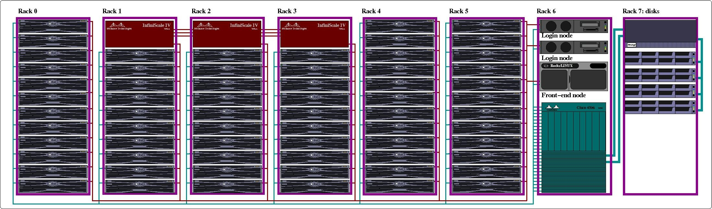

1. [Preamble](introduction.md)
2. [Access to the Cluster](introduction.md)
3. [Using the Cluster](introduction.md)
4. [Software Overview](introduction.md)
5. [Support](introduction.md)

# 1. Preamble

- The cluster, known as `Hydra`, is made of
    1. one front-end node,
    2. two login nodes,
    3. a queue manager/job scheduler, and
    4. a set of compute nodes.

- To access the cluster you must log on one of the two login nodes, using `ssh`:
    - `ssh hydra-login01.si.edu` 
or
    - `ssh hydra-login02.si.edu`

- From either login node you submit and monitor your job(s) via the queue manager/scheduler.
- The job scheduler on Hydra is the Univa Grid Engine, simply GE or UGE (Univa was recently acquired by Altair).
- The Grid Engine runs on the front-end node (`hydra-7.si.edu`), hence the front-end node **should not be used** as a login node.
    - There is no reason for users to ever have to log on `hydra-7`.

- All the nodes (login, front-end and compute nodes) are interconnected
    - via Ethernet (at 10Gbps, aka 10GbE), and
    - via InfiniBand (at 40-100Gbps, aka IB).
- The disks are mounted off different types of dedicated devices:
    1. a two nodes NetApp filer for `/home` and `/data` (via 10GbE),
    2. two GPFS for `/scratch` (via IB at 4x 100Gbs),
    3. two low cost NAS for `/store` (via 10GbE), a near-line storage only available on some nodes,
    4. some partitions on the DAMS Qumolo storage system are accessible via `/qnas` on some nodes.

The following figure is a schematic representation of the cluster:

Note that it does not represent the actual physical layout.

# 2. Access to the Cluster

- To access the `Hydra` cluster you will need
    1. an account;
    2. a secure connection to log in either login nodes; and
    3. a `ssh` client (i.e., a program compatible with the secure shell protocol, aka `ssh`).

## Requesting Accounts

Accounts on Hydra are separate from `CF`, `HEA`, `SI`'s Active Directory, or `VPN` accounts.
- Users should request an account by [submitting a request through the SI Service Portal](https://smithsonianprod.servicenowservices.com/si/?id=sc_cat_item&sys_id=962e05331b96e05078932f41f54bcb3b). 

## Secure Connection

- You can connect to the login nodes using `ssh` only from a machine physically on SINet or via the SI VPN.
- Information on VPN authentication is available [here](https://smithsonianprod.servicenowservices.com/si?sys_kb_id=e2996a031b79ae50e5c0657ae54bcb5d&id=kb_article_view&sysparm_rank=1&sysparm_tsqueryId=b8c7ecb2cf9f43500b16fb152f851cc6).

## SSH Clients

1. Linux users, use `ssh [<usenname>]@<host>`, where
    - `<username>` is your username on hydra if it is different from the computer you are `ssh`'ing from
    - <host> is either of the login nodes name, i.e., `hydra-login01.si.edu` or `hydra-login02.si.edu`
2. MacOS users can use `ssh [<usenname>]@<host>` as explained above from a `Terminal`.
    - Open the Terminal app by going to `/Applications/Utilities` and finding `Terminal`. 
    - You can get to the `Utilities` folder by going to the `Go` menu in the `Finder` and choosing `Utilities.`
3. PC/Windows users need to install a `ssh` client. Public domain options are:
    - Window's `ssh` from the PowerShell (for recent versions of Windows)
    - [PuTTY](introduction.md)
    - [Cygwin](http://www.cygwin.org) and use `ssh [<usenname>]@<host>`(note that Cygwin includes a X11 server.)

See also the [Comparison of SSH clients Wikipedia page](https://en.wikipedia.org/wiki/Comparison_of_SSH_clients).

# 3. Using the Cluster

- To run a job on the cluster you will need to:
    1. install the required software, unless it is already installed;
    2. copy the data your job needs to the cluster; and
    3. write at least one (minimal) script to run your job.

Indeed, the login nodes are for interactive use *only* like editing, compiling, testing, checking results, etc.... and, of course, submitting jobs.

The login nodes are not compute nodes (neither is the head node), and therefore they should not be used for actual computations, except short debugging interactive sessions or short ancillary computations.

The compute nodes are the machines (aka hosts, nodes, servers) on which you run your computations, by submitting a job, or a set of jobs, to the queue system (the Grid Engine or GE).

This is accomplished via the `qsub` command, from a login node, and using a job script. You can also request an interactive session on a compute node using `qrsh.`

::: {.note title="Please"}
Do not run on the login or front-end nodes and do not run jobs *out-of-band*, this means:

- do not log on a compute node to manually start a computation, always use `qsub`;
- do not run scripts/programs that spawn additional tasks, or use multi-threads, unless you have requested the corresponding resources;
- if your script runs something in the background (it shouldn't), use the command `wait` so your job terminates only when all the associated processes have finished;
- to run multi-threaded jobs, read and follow the relevant instructions;
- to run parallel jobs (MPI), read and follow the relevant instructions; 
You don't start MPI jobs on the cluster the way you do on a stand alone computer (or laptop.)
:::

## Remember that

- you will need to write a script, even if trivial, to submit a job (there is a tool to help you do that);
- you should optimize your codes with the appropriate compilation flags for production runs;
- you will most likely need to specify multiple options when submitting your jobs, via the command `qsub`;
- things do not always scale up: as you submit a lot of jobs (in the hundreds), that will run concurrently (at the same time), ask yourself:
    1. is there name space conflict? all the jobs should not write to the same file, they should not have the same name;
    2. what will the resulting I/O load be? do all the jobs read the same file(s), do they write a lot of (useless?) stuff?;
    3. how much disk space will I use? Will my job fill up my allotted disk space? Is the I/O load high compared to the CPU load?
    4. how much CPU time and memory does my job need? Jobs run in queues, these queues have limits.
- *Check-pointing*: computers do crash, networks go down and jobs get killed when they exceed limits, so
    - whenever possible, and especially for long jobs, you should save intermediate results so you can resume a computation from where it stopped.
        - this is known as check-pointing.
    - If you use some third party tool, verify if it uses check-pointing and how to enable it.
    - If you run your own code, you should include check-pointing for long computations.

The cluster is a shared resource: when a resource gets used, it is unavailable to others, hence:

- clobbering disk space prevents other from using it:
    1. trim down your disk usage;
    2. cleanup your disk usage after your computation;
    3. the disks on the cluster are not for long term storage;
    4. move what you don't use on the cluster back to your "home" machine.
- Running un-optimized code wastes CPU cycles and effectively delays/prevents other users from running their analyses.
- Reserving more memory than you need will *effectively* delay/prevent other users from using it.
- Fair use: we have implemented resource limits, do not bypass these limits.
    - If needed, feel free to contact us to review how these limits impact you.

# 4. Software Overview

The cluster runs a Linux distribution that is specific to clusters. We use BrightCluster (v10.0) to deploy Rocky 8.9 (Green Obsidian).

- As for any Unix system, you must properly configure your account to access the system resources. 
Your `~/.bash_profile`, or `~/.profile`, and or `~/.cshrc` files need to be adjusted accordingly.
- The configuration on the cluster is different from the one on the `CF`- or `HEA`-managed machines (for SAO users). 
We have implemented the command `module` to simplify the configuration of your Unix environment (or `conda)`.
- You can look in the directory `~hpc/` for examples of configuration files (with `ls -la ~hpc`).

## Available Compilers

1. GNU compilers (`gcc, g++, gfortran, g90`)
2. Intel compilers and the Cluster Studio (debugger, profiler, etc: `ifort, icc`, ...)
3. NVIDIA compilers (PGI was acquired by NVIDIA, `nvfortran`, `nvcc`, ...)

## Available Libraries

1. MPI, for GNU, PGI/NVIDIA and Intel compilers, w/ IB support;
2. the libraries that come with the compilers;
3. GSL, BLAS, LAPACK, etc.

## Available Software Packages

1. We have 128 run-time licenses for IDL, (FL is available too).
2. Tools like MATLAB, JAVA, PYTHON, R, Julia, etc. are available; and
3. the Bioinformatics and Genomics support group has installed a slew of packages.

Refer to the [Software pages](https://confluence.si.edu/pages/viewpage.action?pageId=11534358) for further details. Other software packages have been installed by users, or can be installed upon request. **

# 5. Support

The cluster is located in Ashburn, VA and is managed by the Office of Data Platforms and Advanced Computing, part of the Office of the Chief Data and AI Officer, itself part of the Office of Digital and Innovation.

The cluster is supported by the following individuals:

- DJ Ding ([DingDJ\@si.edu](mailto:DingDJ@si.edu)), the system administrator.
- Alex White ([WhiteAE\@si.edu](mailto:WhiteAE@si.edu)) - Research Data Scientist, ODI/CDAIO/DPAC.
- Matthew Kweskin ([KweskinM\@si.edu](mailto:KweskinM@si.edu)) - NMNH/L.A.B., IT specialist.
- Mike Trizna ([TriznaM\@si.edu](mailto:TriznaM@si.edu)) - Data Scientist, ODI/CDAIO/DPAC.
- Vanessa Gonzalez ([GonzalezV\@si.edu](mailto:GonzalezV@si.edu)) - NMNH/GGI, biologist.

Support is also provided by other OCIO staff members (networking, etc...).

## Simple Rules

- *For sys-admin issues:* (something is not working any more, etc):
    - Use [SI-HPC-Admin\@si.edu](mailto:SI-HPC-Admin@si.edu)
- *For application support:* (how do I do this?, why did that fail?, etc)*:*
    - Use [SI-HPC\@si.edu](mailto:SI-HPC@si.edu)
- *Password problems:* go to the[self-serve password page](https://hydra-adm01.si.edu/ssp/).
- Please use these email addresses to let the SI/HPC support team address your issues as soon as possible, rather than emailing individuals directly.

## Mailing List

All users of the cluster are added to a mailing list `hpcc-l@cfa.harvard.edu` to provide for notifications of important changes, etc.
