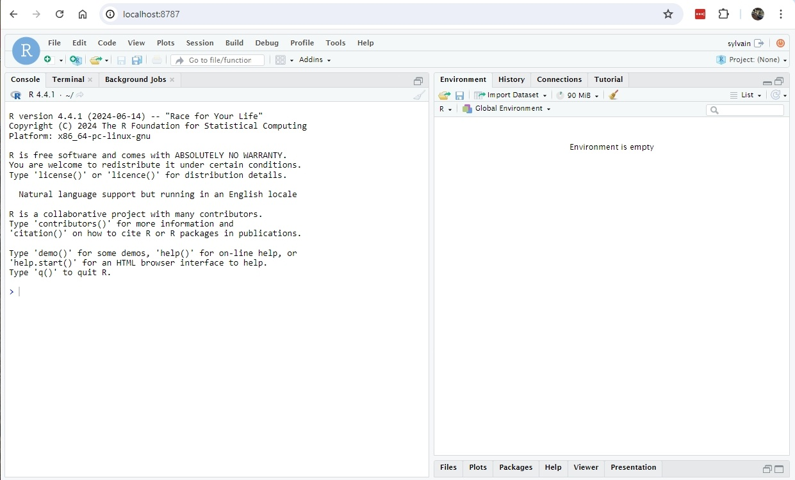
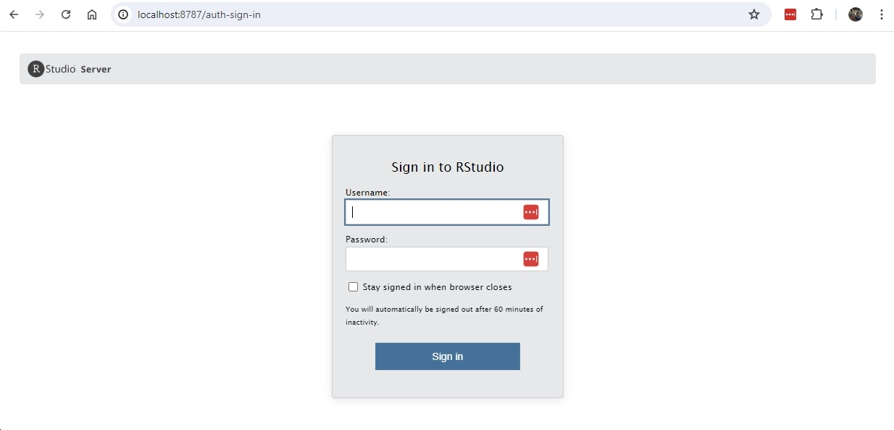

There are two ways to start RStudio on Hydra's nodes, you can either run


1. the RStudio desktop, or
2. the RStudio server.


You can also use Hydra's RStudio Server.


## Which version to use?


They are both full fledged RStudio, but


- the desktop will run on Hydra and display its output on your local machine using the X-Windows protocol: it can be slow and your local machine must support X (via a X server) and your connection must allow X tunneling.
- the server will run on Hydra and use a ssh tunnel on your local machine to allow you to run RStudio inside a browser.


# Running the Desktop


Log in Hydra via one of the login nodes, allowing X-tunneling and


- Start a X-capable interactive session with `qlogin` (**not** `qrsh`)
- Load the `tools/R/RStudio/desktop` module
- Start the desktop with `rstudio --no-sandbox --disable-gpu`
- When done
    - exit the RStudio desktop (File -> Quit Session)
    - terminate the interactive session with `exit`


#### Example:


```{.text title="On the login node"}
sylvain@login01% qlogin
Your job 2453968 ("QLOGIN") has been submitted
waiting for interactive job to be scheduled ...
Your interactive job 2453968 has been successfully scheduled.
Establishing /cm/shared/apps/uge/var/cm/qlogin_wrapper session to host compute-64-15.cm.cluster ...
Last login: Wed Jul  3 10:17:51 2024 from 192.168.92.121

sylvain@compute-64-15% ml tools/R/RStudio/desktop
Loading tools/R/RStudio/desktop/2024.04.2-764
  Loading requirement: tools/R/4.4.1

sylvain@compute-64-15% rstudio --no-sandbox --disable-gpu
```


and you should see on your machine, if the X tunnel is set right:


Note that the RStudio desktop does not work with the Windows `Xming` X-server, but works with Cygwin/X and WSL.


# Running the Server


Log in Hydra via one of the login nodes (no need to enable X-tunnel)


- Start an interactive session with `qrsh`
- Load the `tools/R/RStudio/server` module
- Start the server with `start-rstudio-server`
- Follow the instructions to
    - start the ssh tunnel on your local machine in a terminal window
    - point your browser to `localhost:NNNN`, where NNNN is the port number
- When done
    - exit RStudio in your browser
    - terminate the server as instructed in the window opened to Hydra
    - terminate the interactive session with exit


#### Example:


1. Start the server on an interactive node


```{.text title="On the login node"}
sylvain@login01% qrsh

sylvain@compute-64-16% module load tools/R/RStudio/server
Loading tools/R/RStudio/server/2024.04.2-764
  Loading requirement: tools/R/4.4.1

sylvain@compute-64-16% start-rstudio-server
start-rstudio-server: starting RStudio server on host=compute-64-16 and port=8787
  you need to create a ssh tunnel on your local machine with
    ssh -N -L 8787:compute-64-16:8787 sylvain@hydra-login01.si.edu

Point your browser to http://localhost:8787 on your local machine.
Use Control+C in this window to kill the server when done.

TTY detected. Printing informational message about logging configuration. Logging configuration loaded from '/etc/rstudio/logging.conf'. Logging to '/home/sylvain/.local/share/rstudio/log/rserver.log'.
TTY detected. Printing informational message about logging configuration. Logging configuration loaded from '/etc/rstudio/logging.conf'. Logging to '/home/sylvain/.local/share/rstudio/log/rsession-sylvain.log'.
```


-  If you receive the error message "`[rserver] ERROR system error 98 (Address already in use);`",the TCP port is already in use by another user. Specify a different port in the range of 1025-65535 when starting the server. E.g., `start-studio-server -port 8890`


2. Start the ssh tunnel on your local machine


```{.text title="On your local machine, in a terminal"}
ssh -N -L 8787:compute-64-16:8787 sylvain@hydra-login01.si.edu
```


-  the IP and port numbers - the string `8787:compute-64-16:8787` - are likely to be different, and
    - replace `sylvain` by your username on Hydra.


3. Start a browser on your local machine and go to


`http://localhost:8787`


you should see:





or





(yse your Hydra credentials).


-  Use `start-rstudio-server -help` to see all the options,


### Notes


You could run either, the server or the desktop, on a login node but we *strongly recommend* that you use instead an interactive node:


- processes running on a login node for a long time and consuming resources get slowed down and eventually killed, hence your RStudio might die before you're done.


There are resource limits on interactive sessions, tho,


 Check the relevant documentation regarding the [Interactive Queue](https://confluence.si.edu/display/HPC/Available+Queues#AvailableQueues-InteractiveQueue) under [Available Queues](https://confluence.si.edu/display/HPC/Available+Queues).


RStudio uses R version 4.4.1, not 4.4.0


- if you want to use R 4.4.1, load the `tools/R/4.4.1` module, since loading `tools/R` load version 4.4.0


The RStudio server is by default secured via normal authentication, but


- anybody who knows what port and tunnel you use could connect to *your* RStudio server (and will have access to all your files), hence
    - do not use the default port (8787), pick a number between 8000 and 9999,
    - log off the server when done and,
    - do not leave the server running when not needed.


 Since only people w/ credentials on Hydra can start a ssh tunnel, you are not exposed to the wide world.


- If you logged off using the server log off button, and can't log back in:
    - kill and restart the server,
    - If this fails clear the browser cookies


### **Temporary directories with R and RStudio**


- `R` and `Rstudio` may need temporary disk space, and in some cases a lot of it.
    - The default location is, on Linux systems like Hydra, `/tmp.`
    - See the documentation for the R function [tempdir()](https://stat.ethz.ch/R-manual/R-devel/library/base/html/tempfile.html) for how R determines the path of the per-session temporary directory.
        -  if `/tmp` fills up, a lot of things stop to work, so we recommend that you use a different location for temporary file.
- The location where to store temporary files can be modified by setting the environmental variables [`TMPDIR` , `TMP` , and `TEMP`](https://stat.ethz.ch/R-manual/R-devel/library/base/html/tempfile.html).
    - For `RStudio`, this must be set in an `.Renviron` file, because the shell's environment in which you start the `RStudio` server process is not used.
    - The `.Renviron` file can be in your home directory or in the base of your `RStudio` Project directory.


```{.text title="Example .Renviron file setting TMPDIR"}
TMPDIR=/scratch/genomics/USER/PROJECT/tmp
```


where you replace USER and PROJECT by your username and a more specific project name respectively.
