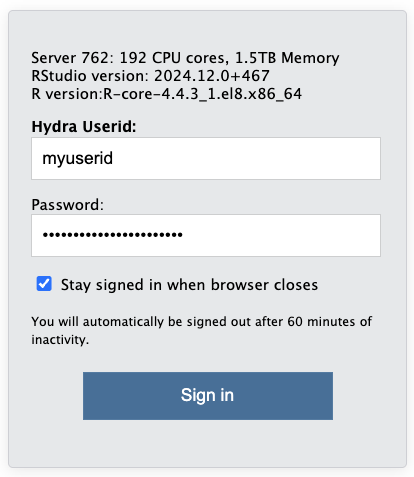
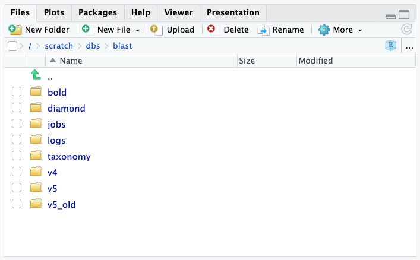
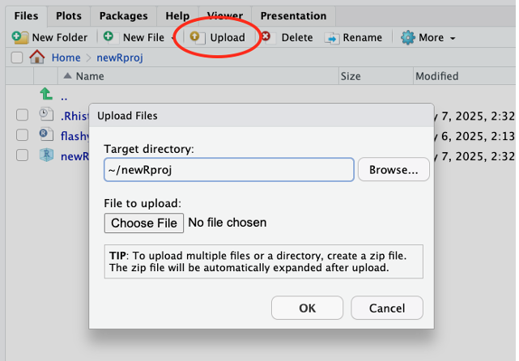
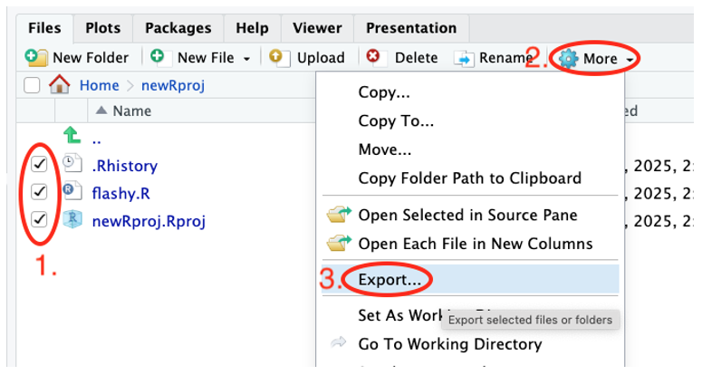
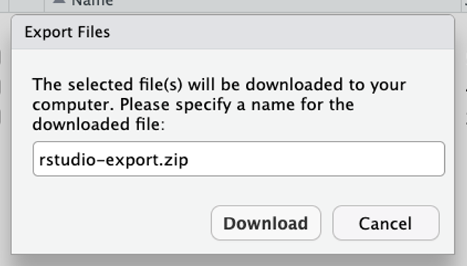

1. [Overview](using-the-rstudio-server.md)
2. [Quick start](using-the-rstudio-server.md)
3. [Software specifications](using-the-rstudio-server.md)
4. [Hardware specifications](using-the-rstudio-server.md)
5. [Remote access](using-the-rstudio-server.md)
6. [RStudio Server vs. workstation](using-the-rstudio-server.md)
    1. [File transfer](using-the-rstudio-server.md)
    2. [R Session](using-the-rstudio-server.md)
    3. [Installing packages](using-the-rstudio-server.md)
    4. [Packages Requiring Newer GCC](using-the-rstudio-server.md)


### 1. Overview


Hydra now offers a dedicated RStudio Server for interactive running of R-based workflows using a familiar GUI.


Users can leverage this server to test, debug, and develop R based workflows using the interactive R Studio GUI (currently running R 4.5.2). By logging in with your Hydra account credentials, users will have access to the storage under /data, /scratch and /store. This server offers resources totaling 192 CPUs and 1.5 T of RAM.


### 1. Quick start


The R Studio environment is accessible directly via a browser, at https://galaxy.si.edu/R4


Just like the other components of Hydra, this server is only accessible from computers connected to Smithsonian networks (i.e., VPN, telework.si.edu, or on-site networks), not on the public internet. See below about remote access to the system.


1. Open https://galaxy.si.edu/R4 in a browser on a computer that has access to Hydra.
2. Log in with your Hydra username (all lowercase) and password. 

3. A web-based interface to a RStudio session running on the server opens. The interface is nearly identical to what you would use on your workstation. 
You can install packages, runs scripts, create R projects, etc. in the same way as your workstation. 

4. The "Files" tab shows Hydra's storage systems. You have access to Hydra's `/home`, `/scratch`, `/data`, etc. 
 You can use the RStudio Server interface to transfer files or use other file transfer tools. See[File transfers below](using-the-rstudio-server.md). 

5. All computations are performed on the dedicated server. If you close the browser window, your R session continues so objects in memory are preserved and computations will continue. See[R Session](using-the-rstudio-server.md)below.


### 3. Software specifications


The instance is running:


- R 4.5.2
- RStudio Server 2024.12.0+467


The version of R and RStudio Server is the same for all users. If these versions impact your use, let us know so we can evaluate the impact of that in future revisions to the system.


### 4. Hardware specifications


The dedicated RStudio Server node has:


- 192 CPU cores
- 1.5 TB of memory


While the server offers substantial resources, these are shared. Be mindful of resource usage and terminate idle R Sessions.


### 5. Remote access


The RStudio Server can be accessed directly from your browser if your computer has one of the VPN enabled that gives access to Hydra.


The Smithsonian Telework website, https://telework.si.edu, can be used to access Hydra without a VPN.


1. Log into[https://telework.si.edu](https://telework.si.edu)
2. In the text box in the top left of the window, under the Smithsonian logo, labeled "*Enter an internal resource*" enter:[https://galaxy.si.edu/R4](https://galaxy.si.edu/R4)and then press the enter/return key. 

3. The RStudio Server login page will open in the same way as if you were onsite.


### 6. RStudio Server vs. workstation


Using RStudio Server is nearly the same as running the standard workstation version of RStudio. Below is some information about how they differ.


#### **a. File transfer**


Your data must be transferred to/from Hydra to work on it - directories in `/homes, /data,` and `/scratch` are all available on this server. Note: `/store` is not available at this time. The Hydra storage guidance, quotas, and scrubber policies apply to data used through the dedicated RStudio server. 
In addition to the existing file transfer tools for Hydra (see the file transfer guide, quick start guide, and Globus), RStudio Server has built-in tools for file transfers. These built-in tools are best for small files or quick edits. For large files or large file sets consider other file transfer tools.


***Using RStudio Server's built-in tools***


- **Upload** from your computer to Hydra: use the “Upload” button in the Files tag. 

    - Only one file can be uploaded at a time. Create a zip archive on your computer to upload several files at once. RStudio Server with unzip them automatically when they’re received.
- **Download** from Hydra to your computer
    - Select the checkboxes for files and folders you want to download.
    - Click the “More” button.
    - Choose “Export…” 

    - In the pop-up window click the Download button to save to your computer. If multiple files or a folder was selected, it will be zipped automatically prior to download. 



#### **b. R Session**


Your R session will continue to run on the server when you close your browser window or log off your computer. Any analyses underway will continue and your memory will be preserved. To re-connect to your R session, log back in to the RStudio Server. This will work even if you log back on from a different computer. ***This allows you to start a long analysis on the server and then disconnect.***


#### Ending your R Session


When you have completed your work on the RStudio Server, please quit your R session to free resources for other users.****


Use “Quit Session...” from the Session or File menu.


#### One R Session limit


RStudio Server only allows one R session per user. This means that if you have an existing session and log in to the server via a browser, control of that session will switch to the current browser. There is not a way to have more than one browser window open with different RStudio and R sessions.


One workaround is to use the “Background Jobs” tab to run multiple analyses at one time. See https://docs.posit.co/ide/user/ide/guide/tools/jobs.html


#### **c. Installing Packages**


You can install R Packages on the RStudio server in the same way you would on the desktop version of RStudio without needing administrative rights to the RStudio Server.


Packages are installed in your personal Library: `~/R/x86_64-redhat-linux-gnu-library/4.5`


⚠️Each user has a personal Library. When one user installs packages in their library, these packages are not available to others.


⚠️ All R packages on Linux systems will be compiled from source. This is unlike Windows or Mac where they are typically downloaded as pre-compiled binaries.


Use the `Ncpus` option in `install.packages()` to speed up installs. For example, this will use 8 CPUs to install the given package and its dependencies in parallel.


```{.text title="install.packages() with multiple CPUs"}
install.packages("seqinr", Ncpus = 8)
```


`Ncpus` is also an option for installing Bioconductor packages:


```{.text title="Installing Bioconductor packages with multiple CPUs"}
BiocManager::install("phyloseq", Ncpus = 8)
```


#### **d. Packages Requiring Newer GCC**


**Problem Summary**


Some CRAN and Bioconductor packages (e.g. ade4, seqinr) require a newer GCC toolchain than the system default. Attempting to install these packages may result in errors such as missing GLIBCXX symbols or OpenMP-related compilation failures.


**Root Cause**:


- Mixed compiler configuration between ~/.Renviron and ~/.R/Makevars
- Mismatched GCC versions across compiler variables
- R packages require a single, consistent compiler toolchain during build and runtime


**Follow the steps below update the GCC compiler variables and solve the install issues:**


**Step 0 – Remove Old Configuration**


If you previously set compiler paths in ~/.Renviron, remove the file before proceeding.


Run in the RStudio Terminal (not the R console):


```
rm ~/.Renviron 
```


**Step 1 – Create Makevars**


Run the following commands in the RStudio Terminal:


```
mkdir -p ~/.R 
nano ~/.R/Makevars 
```


Below is an example Makevars file for GCC 14.2.0:


```
CC = /share/apps/tools/gcc/14.2.0/bin/gcc 
CXX = /share/apps/tools/gcc/14.2.0/bin/g++ 
CXX11 = /share/apps/tools/gcc/14.2.0/bin/g++ 
CXX14 = /share/apps/tools/gcc/14.2.0/bin/g++ 
CXX17 = /share/apps/tools/gcc/14.2.0/bin/g++ 
FC = /share/apps/tools/gcc/14.2.0/bin/gfortran 
F77 = /share/apps/tools/gcc/14.2.0/bin/gfortran 

CFLAGS = -O2 -g -fopenmp -fpic 
CXXFLAGS = -O2 -g -fopenmp -fpic 
CXX11FLAGS = -O2 -g -fopenmp -fpic 
CXX14FLAGS = -O2 -g -fopenmp -fpic 
CXX17FLAGS = -O2 -g -fopenmp -fpic 
FFLAGS = -O2 -g -fpic 
FCFLAGS = -O2 -g -fpic 
```


If you need a different version, replace the 14.2.0 above with one of the other versions available on Hydra.


**GCC Versions Available**


- 9.2.0, 9.3.0, 10.1.0 – OpenMP 4.5
- 11.2.0, 12.2.0 – OpenMP 5.0
- 13.2.0, 14.2.0, 15.2.0 – OpenMP 5.1


Packages such as ade4 require GCC >= 10.1.0.


-------


Save and exit: Ctrl+O, Enter, Ctrl+X


**Step 2 – Restart R**


In RStudio, select Session → Restart R. Compiler changes will not take effect until R is restarted.


**Step 3 – Install Packages**


Install packages using standard commands:


```
install.packages(""ade4"") 
BiocManager::install(""PackageName"") 
```


**Reverting to System GCC**


Remove the Makevars file:


```
rm ~/.R/Makevars 
```


Then restart R.


**Troubleshooting**


- GCC mismatch errors: ensure no compiler variables exist in ~/.Renviron
- GLIBCXX errors: rebuild packages using a newer GCC
- Package loads fail: verify all compiler variables point to the same GCC path
